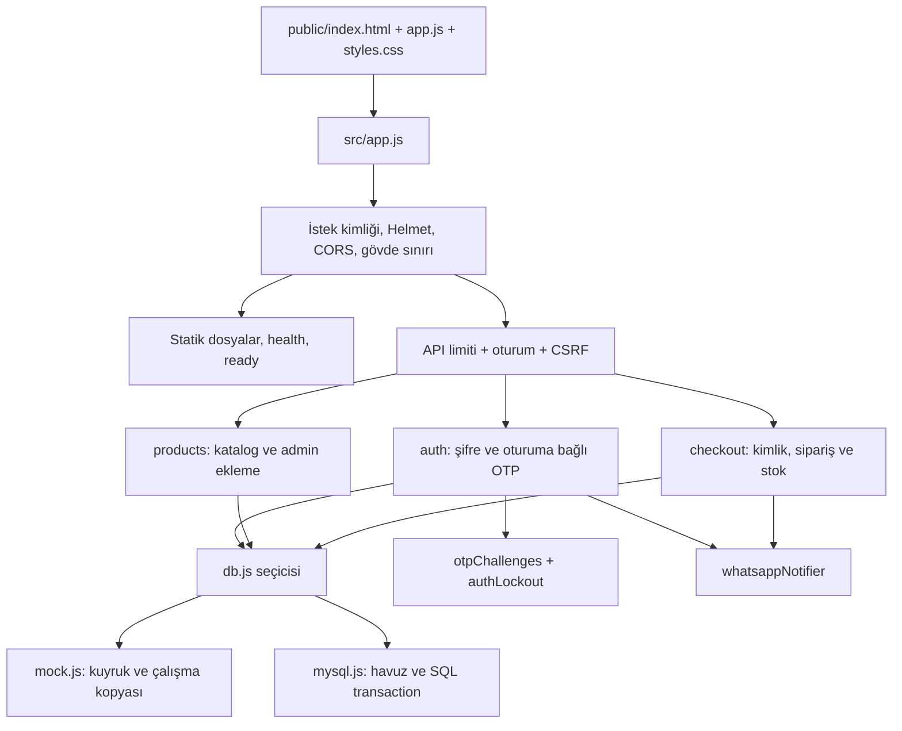

# SecureShop: kodu izleyerek öğrenme rehberi

Bu rehber 21 Eylül 2026 uygulamasını anlatır. İnceleme sırasındaki hatalar ve kullanıcı kararları [uygulama planında](UYGULAMA_PLANI.md); çalıştırılmış testler ve sınırları [doğrulama kaydında](docs/DOGRULAMA.md) bulunur. Ürünü tanımak için bu sayfayı sırayla okuyabilir, kodu değiştireceğin zaman dosya ve fonksiyon tablolarına dönebilirsin.

## 1. Ne yapıyoruz, ne saklıyoruz?

SecureShop bir deneme mağazasıdır. Ziyaretçi 17 örnek ürünü görür ve metinle arar. Hesap açarken kullanıcı adı, uluslararası telefon numarası ve şifre verir. Girişte şifreyi, sonra altı rakamlı doğrulama kodunu kullanır. Giriş yapan kullanıcı ürünleri sepete ekler, adres girer, sipariş kaydeder ve yalnız kendi siparişlerini görür. Yönetici ürün ekleme **API**'sine sahiptir; bunun için ayrı yönetim ekranı yoktur.

API, başka bir programın uygulamaya istek gönderebilmesi için tanımlanan kapıdır. Örneğin tarayıcı `GET /api/products` gönderince sunucu HTML sayfası yerine JSON verir. JSON, `{ "id": 1 }` gibi anahtar/değer çiftleri taşıyan metin biçimidir. Arayüz bu veriyi ürün kartına dönüştürür.

Ödeme, gerçek kargo, iptal/iade, şifre kurtarma, telefon sahipliğini kayıt sırasında doğrulama ve misafir sepeti yoktur. Katalogdaki dolar fiyatları örnek veridir. Sipariş başarısı para çekildiği anlamına gelmez.

Üç farklı ömür vardır:

| Veri | Nerede? | Ne zaman kaybolur? |
| --- | --- | --- |
| Sepet, doldurulan adres, belirsiz sipariş denemesinin anahtarı | Tarayıcı sayfasının JavaScript belleği | Sayfa yenilenince veya çıkışta. LocalStorage kullanılmaz. |
| Oturum, OTP, deneme kilitleri, IP limitleri | Bir Node sürecinin belleği | Süre dolunca veya süreç kapanınca. Birden çok sunucuda paylaşılmaz. |
| Kullanıcı, katalog, sipariş ve stok | Açıkça seçilmiş mock belleği veya MySQL | Mock'ta süreç kapanınca; MySQL'de veritabanı korunur. |

**Mock**, gerçek veritabanı yerine aynı veri erişim yöntemlerini bellekte gerçekleştiren taklittir. Gerçek MySQL davranışının tamamını kanıtlamaz. Bu yüzden aynı veri sözleşmesi iki ayrı test yolunda sınanır.

## 2. Kurulum ve ilk alışveriş

### 2.1 Hızlı bellek demosu

Node.js, JavaScript'i tarayıcı dışında çalıştırır. Bu repo Node **24** hattını kullanır. npm bağımlılıkları kuran araçtır. `.nvmrc` 24 seçimini belirtir; `package.json` desteklenen aralığı `>=24 <25` olarak sınırlar.

Repo kökünde:

```bash
node --version
npm --version
npm ci --ignore-scripts
cp -n .env.example .env
npm start
```

`npm ci`, `package-lock.json` dosyasındaki kesin bağımlılık ağacını kurar. `--ignore-scripts` kurulum sırasında paketlerin ek yaşam döngüsü betiklerini çalıştırmaz. Bu projenin kurulu paketleriyle test edilmiş yoldur. `cp -n` var olan `.env` dosyasını korur; eski ayarları kendiliğinden güncellemez.

`.env`, yalnız bu bilgisayara ait ayarları taşır; Git tarafından dışlanır. Örnek dosyada `DB_MOCK=true` olduğu için veritabanı sunucusu gerekmez. [127.0.0.1:3000](http://127.0.0.1:3000) adresini aç. Hazır hesap `admin`, şifre `Admin@123!`. Şifre doğruysa sunucu terminalinde yalnız development moduna özel bir satır görünür:

```text
[YEREL DEMO] Sonu 5555 olan numara için kod: (o anda üretilen altı rakam)
```

Ekrana o kodu gir. Kod tarayıcı yanıtına veya dosya loguna yazılmaz. Yerel demo kodu gerçek telefonuna göndermez. Hazır hesabın bilinen şifresi, internete açık servis hesabı olarak kullanılmamalıdır.

Bir ürünü sepete ekle, Sepetim'i aç, örnek adresi doldur ve siparişi tamamla. Ürünün stok sayısı azalır. Siparişlerim → Detayları göster yoluyla adresi ve kalemleri görürsün. Escape sepeti kapatır ve odak açan düğmeye döner. Giriş, kayıt, arama ve sipariş gerçek `<form>` elemanlarıdır; Enter ile gönderilebilir.

Geliştirmede `npm run dev`, nodemon ile sunucu kodu değiştiğinde süreci yeniden başlatır. Yeniden başlatma oturumları ve mock verileri sıfırlar. Tarayıcı JS/CSS değişince sayfayı yenilemek gerekir; derleme veya otomatik sayfa yenileme sistemi yoktur. Normal sunucuyu Ctrl+C ile kapatabilirsin.

### 2.2 Yerel MySQL: kalıcı örnek veriler

MySQL verileri tablolar halinde disk üzerinde tutar. Docker burada uygulamayı değil, veritabanı sunucusunu ayrı bir **konteyner** içinde çalıştırır. Konteyner bir süreci bağımlılıklarıyla izole eder; volume ise konteynerin ömründen bağımsız saklama alanıdır.

```bash
docker compose up -d --wait
```

`compose.yaml` MySQL 8.4'ü yalnız `127.0.0.1:3307` üzerinden erişilebilir açar. DB adı/kullanıcısı `secureshop`, parolası `local-demo-password` olur. Bunlar yerel örnek değerlerdir. `.env` dosyasında yalnız `DB_MOCK=false` yapıp DB ayarlarının örnekle eşleştiğini kontrol et:

```bash
npm run db:init
npm start
```

Kurucu boş veritabanına altı tabloyu, yedi kategoriyi, 17 ürünü ve demo yöneticiyi ekler. Dolu DB'yi reddeder; silme veya yeniden tohumlama yapmaz. İlk kurulum yarıda kalırsa MySQL DDL komutlarının otomatik commit yaptığını hatırla: tablolar oluşmuş, seed işlemi geri alınmış olabilir. Var olan verileri silerek çözmeye çalışma; test için yeni boş DB seç, değerli veride önce yedekle ve nedeni incele.

`docker compose stop` DB'yi durdurur, volume kalır. `docker compose start` yeniden çalıştırır. Silme gerektirmeyen bu komutlar günlük çalışma için yeterlidir. `down -v` veri siler; normal kurulum adımı değildir.

**Eski veritabanı sınırı:** Eski şemada `orders.request_key` ve `request_hash` yoktur. `db:init` bir migration (eski veriyi yeni şemaya taşıma) aracı değildir. Mevcut DB üstüne yeni şemayı çalıştırma. Bu çalışmada gerçek mevcut verinin göçü kabul kapsamına alınmadı. Eski kayıtları koruyarak geçiş istenirse yedek/kopya üzerinde yeni sütunların eski satırlara ne değer alacağı ve yeni CHECK kısıtlarına uymayan veriler ayrıca planlanmalıdır. Kör HTML entity çözme veya tablo silme uygulanmadı.

### 2.3 Ortam değişkenleri

| Ayar | Varsayılan/örnek | Etkisi ve hata yolu |
| --- | --- | --- |
| `NODE_ENV` | development | Yalnız development/test/production. Yanlış değer başlangıcı durdurur. |
| `HOST`, `PORT` | 127.0.0.1, 3000 | Dinlenecek adres; port 1–65535. Tüm ağa açmak yerel varsayılan değildir. |
| `DB_MOCK` | kodda false, örnekte true | `true` açık demo tercihi. Eksik DB ayarı veya bağlantı hatası mock'a geçmez. |
| `DB_HOST/PORT/NAME/USER/PASSWORD` | örnekte yerel Compose | Gerçek modda host/ad/kullanıcı/parola zorunlu. Bağlantı havuzu en çok 5 bağlantı, 20 bekleyen iş kabul eder. |
| `DB_TLS`, `DB_SSL_CA` | yerelde false | TLS bağlantıyı şifreler. Üretimde true zorunlu, sertifika doğrulaması kapatılamaz; CA dosyası isteğe bağlı açık yoldur. |
| `SESSION_SECRET` | yerelde boş → rastgele | Oturum çerezini imzalar. Boş yerel değer her açılışta değişir. Üretimde en az 32 karakter ve yer tutucu olmayan değer zorunlu. |
| `SESSION_TTL_MS` | 3600000 | Oturum süresi, 1000–86400000 ms. Oturum deposu süresi dolanı da reddeder. |
| `ALLOWED_ORIGINS` | yerelde boş | Virgülle ayrılan tam origin: protokol + host + port. Son slash/yol geçersiz. Üretimde HTTPS ve en az bir değer gerekir. |
| `TRUST_PROXY_HOPS` | 0 | Öndeki güvenilen proxy sayısı, 0–5. Gerçek proxy zinciri bilinmeden yükseltme; IP ve HTTPS algısını değiştirir. |
| `ALLOW_MEMORY_STORE_IN_PRODUCTION` | false | Üretim MemoryStore engelini ancak açık kısa demo istisnasıyla aşar; kalıcı/paylaşılan depolama sağlamaz. |
| `ALLOW_LOCALHOST_DB_IN_PRODUCTION` | false | Üretimde loopback DB kontrolünün ayrı istisnası. DB TLS şartını kaldırmaz. |
| `WHATSAPP_NOTIFICATIONS_ENABLED` | false | Yalnız sipariş bildirimini açar. Giriş kodu akışı ayrı çalışır. |
| `WHATSAPP_MOCK_SEND` | false | Development/test zaten daima mock. Production app true değerini reddeder. |
| `WHATSAPP_TIMEOUT_MS` | 5000 | 50–15000 ms; gönderim ve yanıt gövdesi için ortak süre bütçesi. |
| `WHATSAPP_GRAPH_API_VERSION`, `ACCESS_TOKEN`, `PHONE_NUMBER_ID` | boş | Gerçek gönderimde açık ayar gerekir. Sürüm bilinçli olarak eski bir varsayılana bağlanmaz. |
| `WHATSAPP_TO_PHONE_NUMBER` | boş | Sipariş mesajının sabit alıcısı; otomatik olarak müşterinin telefonu değildir. |
| `LOG_DIR` | boş | Boşsa konsol; doluysa yazılabilir dizinde dönen, sınırlı dosya kaydı. |

Boolean ayarlar `true` veya `false` yazılır; `DB_MOCK=yes` reddedilir. Production korumalarını geçmek bu uygulamayı üretime hazır yapmaz. Yeniden başlatmaya dayanıklı/paylaşılan oturum, kurtarma, canlı mesaj teslimatı ve ödeme tasarımı hâlâ ayrı işlerdir.

## 3. İstek hangi yoldan geçer?

**HTTP**, tarayıcı ve sunucunun istek/yanıt konuşma biçimidir. GET okumak, POST değişiklik talep etmek için kullanılır. Express içinde **middleware**, isteği sırayla kontrol eden ara fonksiyondur. `next()` çağırırsa sıra sonraki fonksiyona geçer; `res.json(...)` yanıtı gönderir. `next(error)` hata zincirine gider.



`src/server.js` önce DB'nin cevap verdiğini doğrular, sonra portu dinler. `src/app.js` yalnız Express uygulamasını kurar; testte import etmek port açmaz. SIGTERM/SIGINT geldiğinde readiness kapanma durumuna geçer, sunucu yeni bağlantı kabul etmeyi keser, mevcut işler için en fazla 10 saniye bekler ve DB havuzunu kapatır.

### Güvenlik katmanlarını somutlaştırma

- **Çerez (cookie):** Tarayıcının isteklere eklediği küçük bilgi. `sid`, sunucu belleğindeki oturum kaydının kimliğidir; şifre taşımaz. HttpOnly JavaScript'in okumasını engeller. SameSite=Strict siteler arası gönderimi kısıtlar. Production'da Secure yalnız HTTPS üzerinden gönderilmesini sağlar.
- **CSRF:** Başka bir sitenin açık oturumunla istemediğin POST göndermesi. `GET /api/csrf-token` oturumda saklanan rastgele token'ı verir; POST aynı token'ı `X-CSRF-Token` başlığında sunar. Login başarılı olunca oturum kimliği ve token yenilenir. Arayüz sadece `CSRF_INVALID` reddinde token'ı yenileyerek bir kez tekrar eder; bütün hatalarda otomatik POST tekrarlamaz.
- **CORS:** Hangi origin'deki tarayıcı sayfasının yanıtları okuyabileceğini belirler. Aynı loopback origin'in portu serbesttir; başka origin açık izin listesi olmadan 403 alır. CORS tek başına kimlik doğrulama değildir; tarayıcı dışı istemci Origin göndermeyebilir.
- **CSP:** Tarayıcıya hangi kaynakların çalışabileceğini belirten yanıt başlığı. Script/style yalnız aynı sunucudan gelir; inline kod ve inline style izinli değildir. HTML içindeki `onClick` yerine JS dosyasında `addEventListener` kullanılır.
- **XSS:** Veriyi sayfa kodu gibi çalıştırma hatası. Adres `<script>…</script>` içerebilir; DB özgün metni tutar, arayüz `textContent` ile yazı gösterir. Önceden HTML escape ederek depolamak `O'Connor` gibi metinleri bozuyordu. Güvenli çıkış bağlamı seçmek, girdi biçimini doğrulamaktan farklı bir iştir.
- **Parametreli SQL:** `WHERE id = ?` ifadesindeki değer ayrı gönderilir; kullanıcı metni SQL komutuna eklenmez. Aramada `%`, `_`, `!` LIKE açısından ayrıca kaçırılır; `%` araması bütün kataloğu istemek anlamına gelmez.

## 4. API sözleşmesi

İstemci fiyat veya kullanıcı kimliği bildirerek sipariş tutarını/yetkisini seçemez; sunucu oturum ve DB kayıtlarına bakar. JSON gövdeleri en fazla 10 KB. Hata yanıtı güvenli `error`, kararlı `code`, gerektiğinde `details` ve `retryAfter` içerir. `X-Request-ID` her yanıtta bulunur; beklenmeyen hata yanıtlarında aynı kimlik gövdeye de eklenir.

| Yol | Girdi/yetki | Başarı ve önemli retler |
| --- | --- | --- |
| `GET /health` | Açık | 200 alive; kapanırken 503 stopping. DB'yi sorgulamaz. |
| `GET /ready` | Açık | DB `SELECT 1`/mock kontrolü geçerse 200 ready; aksi hâlde 503. |
| `GET /api/csrf-token` | Oturum oluşturabilir | Token verir; cache edilmez. |
| `POST /api/auth/register` | username, phoneNumber, password + CSRF | 201; biçim 400, kullanıcı/telefon çakışması 409. |
| `POST /api/auth/login` | username, password + CSRF | 200 otpRequired/expiresAt/resendAt; yanlış şifre 401, kilit/gönderim sınırı 429, teslimat sorunu 503. |
| `POST /api/auth/resend-otp` | Aynı tarayıcıdaki bekleyen giriş + CSRF | Yeni kod; eskisi kaldırılır. Süre/gönderim sınırı 429; challenge yoksa 401. |
| `POST /api/auth/verify-otp` | username, otpCode + CSRF | Aynı oturum challenge'ı tüketilirse 200 user. Başka tarayıcı, eski veya yanlış kod 401; kilit 429. |
| `POST /api/auth/logout` | CSRF | Oturumu/challenge'ı siler, sid çerezini temizler. |
| `GET /api/auth/me` | Aktif hesaplı oturum | userId, username; yoksa 401. |
| `GET /api/products` | q, category, page isteğe bağlı | Ürünler + pagination. Sayfa 1–1000; boyut 20. Mevcut arayüz ilk sayfayı kullanır. |
| `GET /api/products/:id` | Pozitif kimlik | İlgili aktif ürün; yoksa 404. |
| `POST /api/products` | Admin + CSRF + ürün alanları | 201 id; müşteri 403; biçim/kategori 400. |
| `POST /api/checkout` | Aktif oturum, CSRF, UUIDv4 Idempotency-Key; items ve shippingAddress | İlk kayıt 201; aynı anahtar/gövde 200 replayed; farklı gövde 409. |
| `GET /api/checkout/orders` | Aktif oturum | Kullanıcının en yeni 50 siparişi. |
| `GET /api/checkout/orders/:id` | Aktif oturum, pozitif kimlik | Yalnız sahibine detay; başkasının veya olmayan sipariş 404. |
| Bilinmeyen yol | Herkes | JSON 404; bilinmeyen API HTML başarıya dönmez. |

Ürün: ad 1–255, açıklama en fazla 2000 karakter, fiyat pozitif/en fazla iki ondalık, stok 0–1.000.000, mevcut kategori. Para alanı `DECIMAL(10,2)` sınırına uyar: en fazla 99.999.999,99.

Sipariş 1–50 ham satır; her satırın adedi 1–99. Tek ürünün tekrar eden satırları önce birleştirilir, birleşen adet stokla karşılaştırılır. **Önceki API kuralı korunmuştur:** toplamın 99'u aşması stok yeterliyse mümkündür; yeni toplam 99 kuralı eklenmedi. Ekran aynı ürünü tek satırla tuttuğu için oradaki sınır `min(stok, 99)` olur. Sokak 5–200, şehir 2–100 karakter. Baş/son boşluklar temizlenir; içerikteki apostrof/Türkçe karakterler korunur.

## 5. Kaynak dosyaları ve işlevlerin tamamı

Aşağıdaki tablolar repo dosyalarını tek tek kapsar. `require` bir modülün dışa açtığı nesneyi alır; `module.exports` bu nesneyi belirler. `async` fonksiyon bir Promise, yani sonradan tamamlanacak sonuç döndürür. `await` yalnız ilgili akışı bekletir; başka HTTP istekleri o arada çalışabilir. OTP atomikliği ve DB kilitleri bu nedenle gereklidir.

### 5.1 Başlangıç, yapılandırma ve ortak araçlar

| Dosya / blok veya fonksiyon | Girdi, çıktı, durum ve ilişki |
| --- | --- |
| `src/server.js` dosya düzeyi | app/db/logger yükler; server ve stopping değişkenleri oluşturur. SIGINT/SIGTERM, yakalanmamış hata ve Promise reddi olaylarını bağlar. Bu süreç olayları testlerin import ettiği app'e yüklenmez. |
| `start()` | Girdi yok. `db.ready()` başarısından sonra host/port dinlenir. DB reddinde başarı logu veya mock fallback yok; shutdown(1) çağrılır. Listener error da kontrollü kapanır. |
| `shutdown(exitCode)` | Tek sefer çalışır; stopping/readiness durumunu değiştirir. HTTP bağlantıları, DB ve oturum temizlik timer'ını kapatır. 10 saniyelik son süre aşılırsa 1 ile çıkar; normal SIGTERM 0. |
| `src/app.js` dosya düzeyi | dotenv'den ayarları okur; Express sırasını kurar ve app'i export eder. Request callback UUID üretir; Helmet güvenlik başlıklarını ekler. CORS callback tam origin kontrol eder, uygun değilse AppError403 verir. |
| app health/ready callback'leri | Health yalnız süreç durumuna; ready DB'ye bakar. Ready hata ayrıntısı/sır döndürmez. Static middleware public dosyalarını sunar. API limiter ve no-store başlığı oturumdan önce gelir. |
| app session/CSRF blokları | MemoryStore, HttpOnly/Strict çerez ve csrf-sync kurulur. Her dakika `store.all` ile süresi dolan kayıtlar temizlenir; timer `unref` ile tek başına süreci açık tutmaz. `app.locals.dispose()` timer'ı durdurur. Token callback `generateToken(req)` sonucunu JSON yapar; API POST'ları CSRF'den geçer. Son sıra 404 → CSRF hata → genel hata. |
| `src/config/runtime.js` `integer(env,key,fallback,min,max)` | Boş değerde varsayılan; tamsayı/range dışıysa hata. Port, süre ve proxy için ortak. |
| `boolean(env,key,fallback)` | Sadece true/false dizgesi kabul edilir; sessizce doğruya çevirmez. |
| `readRuntime(env)` | Çalışma modu, secret, üretim korumaları, exact origin, host/port/proxy/oturum süresi nesnesini döndürür. Üretimde eksik/yanlış ayar erken hata verir. Yerelde boş secret crypto.randomBytes ile üretilir. |
| `readDatabase(env)` | Açık mock seçimini veya mysql2 pool seçeneklerini döndürür. Eksik ayarı, üretim mock/localhost/TLS ihlalini reddeder. CA yolu verilirse dosyasını okur; okunamıyorsa başlangıç hatasıdır. |
| `src/config/session.js` | Tek sabit `SESSION_COOKIE_NAME='sid'`; app ve logout aynı adı kullanır. |
| `src/utils/errors.js` `AppError` sınıfı/constructor | status, code, message, details alır; Error'dan türeyen kontrollü hata oluşturur. Hata middleware'i yalnız bu sınıfın mesajını güvenli uygulama mesajı sayar. |
| `src/utils/money.js` `toCents(value)` | Sayı/metni en çok iki ondalıklı pozitif biçim olarak çözer; tamsayı kuruş döndürür. Virgül, üstel yazım, negatif ve sınır aşımı reddedilir. `0.10` → 10. Sıfır dönüşümde mümkün; ürün sözleşmesi fiyatın >0 olmasını ayrıca ister. |
| `fromCents(cents)`, `MAX_CENTS` | Güvenli tamsayıyı iki ondalıklı dizgeye çevirir; DB'ye kayan noktalı ara sonuç gönderilmez. Üst sınır 9999999999 kuruştur. |
| `src/utils/logger.js` `redact(value,depth)` | Nesne/dizi içinde hassas adlara sahip alanları `[REDACTED]` yapar; aşırı derin nesneyi sınırlar. password, secret, token, authorization, cookie, otp, phone, address, body, hash eşleşir. Serbest message içine sır koymama sorumluluğu çağırandadır. |
| logger format/transport blokları | Winston JSON formatına zaman damgası ve redaction uygular. Testte sessiz, normalde konsol; açık LOG_DIR'de 5 MB'lık en çok 3 dönen dosya. SQL parametresi, raw HTTP body veya raw exception stack loglanmaz. |
| `logger.security(event,metadata)` | Güvenlik olayını yapılandırılmış ve maskelenen alanlarla yazar. Kullanıcı şifresini/giriş kodunu almaz. |
| `logger.localOtp(phone,code)` | Sadece development'ta stderr'e telefonun son 4 hanesi ve yerel test kodunu yazar. Winston dosya transport'undan geçmez. Gerçek production kodu burada gösterilmez. |

### 5.2 İstek doğrulama ve erişim

| Dosya / fonksiyon | İşleyiş |
| --- | --- |
| `src/middleware/validation.js` `handleValidationErrors` | express-validator sonuçlarını toplar. Hata varsa 400 + alan/message listesi; ham girdi/parola döndürmez. Yoksa next. |
| `username()`, `password(registration)` | Her kullanımda yeni doğrulama zinciri üretir. Kullanıcı adını ASCII harf/rakam ve uzunlukla sınırlar. Şifreyi **UTF-8 byteLength <=72** ile denetler; karakter sayısı tek başına bcrypt kesilmesini önlemez. |
| `validateRegister`, `validateLogin`, `validateOtpVerify` | Bunlar middleware dizileridir. Tür → trim gereken alan → uzunluk/biçim → hataları yanıtla sırasını izler. Kayıt şifre karmaşıklığını ekler; şifreyi trim etmez. OTP altı rakamlı string olmalıdır. |
| `validateSearch`, `validateIdParam` | Arama metni literal kalır. Sayfa ve ID aralığı kontrol edilip tamsayıya çevrilir; negatif, NaN ve aşırı büyük değerler query'ye ulaşmaz. |
| `validateOrder` | UUIDv4 işlem başlığı, item dizisi, ürün/adetler ve adres nesnesini kontrol eder. Sunucu yalnız street/city'yi alır; fazladan body alanları order hash'ine veya DB'ye girmez. |
| `validateProduct` | İsim/açıklama türü ve uzunluğu, toCents ile fiyat, stok ve kategori kimliği doğrulanır. Sadece route kontrolüyle yetinilmez; model sözleşmesi ve MySQL kısıtları da vardır. |
| `src/middleware/requireAuth.js` `requireAuth` | Oturum userId'si yoksa 401. Varsa her istekte DB'den güncel kullanıcıyı okur; pasif/silinmiş hesapta oturumu yok edip 401 verir. Başarılıysa req.user yazıp next. DB hatası next(error). |
| `src/middleware/rateLimiter.js` `createLimiter(max,windowMs,code)` | IP başına sayacı tutan middleware üretir. Limitte standart başlıklar, 429, code/retryAfter verir. Başarılı giriş talepleri de sayılır; OTP gönderimi sınırsız olamaz. |
| loginLimiter/otpLimiter/registerLimiter/apiLimiter | Dosya düzeyinde ortam moduna göre oluşturulur. Production: login10/15dk, OTP30/15dk, kayıt3/saat; diğer modlarda login100/dk, OTP300/dk, kayıt100/dk. API testte5000/15dk, normalde300/15dk. IP anahtarı proxy ayarına bağlıdır. |
| `src/middleware/errorHandler.js` `notFoundHandler` | 404 NOT_FOUND JSON'u verir; bilinmeyen API yolu index.html'e yönlenmez. |
| `csrfErrorHandler` | Yalnız EBADCSRFTOKEN hatasını 403 CSRF_INVALID yapar; diğerini next'e aktarır. |
| `globalErrorHandler` | Headers gönderilmişse Express'e bırakır. AppError'ı kontrollü status/code ile, DB erişim/kilit sorununu503, parse hatasını400, büyük gövdeyi413, beklenmeyeni500 yapar. Raw SQL/hata metnini istemciye vermez. Request ID ile güvenli log kaydı oluşturur. |

### 5.3 Giriş ve kod yaşam döngüsü

**Hash (özet)**, veriden geri çevrilmesi amaçlanmayan sabit biçimli sonuç üretir. Şifreler bcrypt maliyet12 ile yavaş özetlenir. Altı haneli kodların alanı küçük olduğu için salt bir hızlı hash'in bellekte ele geçirilmesi kolay taranabilir; burada süreç başına rastgele gizli anahtarla **HMAC** kullanılır. HMAC, anahtar olmadan kod denemelerinin özetini üretmeyi engelleyen imzalı özet yöntemidir. Kodun aslı yalnız bildirim fonksiyonuna geçici olarak gönderilir.

| Dosya / işlev | Girdi, çıktı ve durum |
| --- | --- |
| `src/routes/auth.js` dosya düzeyi | Router, DB, bcrypt, challenge/kilit ve notifier bağlarını kurar. Bulunmayan kullanıcı için gerçek bir dummy bcrypt hash'i üreterek karşılaştırma adımını yine yapar; bunun tam zaman eşitliği garantisi olduğu iddia edilmez. |
| `userView(user)` | Oturum açma yanıtına id, username, phoneNumber seçer; hash/role gibi DB alanlarını eklemez. |
| `rejectLocked(res,status,otp)` | 429 ve Retry-After başlığını, parola veya OTP için uygun kararlı kodla gönderir. |
| `deliver(user,sessionId)` | Önce reserve ile kodu/sınır hakkını ayırır; notifier'ı bekler. Başarısız veya artık güncel olmayan teslimatta yalnız kendi challenge'ını silip503 verir. Başarı expiresAt/resendAt döndürür; kodu yanıtlamaz. |
| POST register callback | Validasyon sonrası bcrypt.hash12; db.createUser; 201. Aynı kullanıcı/telefon modelde409. Hatalar next'e gider. |
| POST login callback | Kullanıcıya göre parola kilidini kontrol eder. DB'deki active hesap ve bcrypt.compare başarılı değilse başarısızlık sayar;401/429. Başarılıysa parola sayacı temizlenir, bu sessionId için kod gönderilir; önceki authenticated userId silinir. Bu aşama tam giriş sayılmaz. |
| POST resend callback | Kullanıcı adını body'den seçmez, bu oturumun challenge'ını bulur. OTP kilidi ve aktif hesabı kontrol eder; deliver yeni kod ayırır. Kod ömrü geçmişse şifre adımına dönülür. |
| POST verify callback + regenerate/save callback'leri | Kilit kontrolünden sonra consume kodu **await olmadan** siler. Yanlış kodda OTP sayacı artar; challenge'sız rastgele saldırı kullanıcı kilidini tüketmez. Aktif hesap DB'den yeniden okunur, session.regenerate yeni kimlik üretir; session.save tamamlanınca200. DB/save hatasında kod tekrar kullanılamaz, yeni giriş gerekir. |
| POST logout callback + destroy callback | Bu oturumun bekleyen kodunu ve session kaydını siler, aynı cookie path/name ile sid'yi temizler. Depo hatasında başarı bildirimi verilmez. |
| GET me callback | requireAuth'ın doğruladığı kimliği sunar. Test export'ları `_pendingOtps`, `_OTP_TTL_MS`, `_resetAuthLockouts` HTTP endpoint değildir. |
| `src/services/otpChallenges.js` durum blokları | pending: challengeID→kayıt; bySession: sessionID→challengeID; sendState: küçük harfe çevrilmiş kullanıcı→gönderim bütçesi. Rastgele pepper sadece süreç belleğinde. En çok10000 kayıt, 5dk kod ömrü,30sn tekrar aralığı,15dk'da5 gönderim. |
| `keyFor`, `digest` | Kullanıcı adını küçük harfe çevirir; challengeID:kod birleşiminin HMAC-SHA256 Buffer'ını üretir. OTP için Math.random kullanılmaz. |
| `remove(id)`, `cancelSession(sessionId)` | Yalnız ilgili challenge'ı ve ona hâlâ işaret eden session bağını siler. Eski teslimat yenisini yanlışlıkla silemez. |
| `cleanup()` ve dakika timer'ı | Süresi dolmuş pending ve sendState kayıtlarını temizler. Her reserve/forSession sırasında da çağrılır. Timer unref edilir. |
| `reserve(user,sessionId)` | Cooldown/gönderim bütçesi/kapasite kontrolü; aynı oturumdaki eski challenge'ı iptal; kriptografik rastgele ID ve100000–999999 kod üretimi. Hash/kayıt eklenir, delivered=false; code yalnız dönüşte teslimat içindir. Limitte429 + süre, kapasitede503. |
| `forSession(sessionId,username)` | Aktif challenge'ı yalnız session eşleşiyorsa ve verilmiş username aynıysa döndürür; yoksa null. |
| `confirmDelivery(entry)` | entry hâlâ aynı güncel kayıt ve süresi geçmemişse delivered=true; değilse false. |
| `consume(sessionId,username,code)` | Yok/teslim edilmemişse null; timingSafeEqual yanlışsa false; doğruysa remove sonra entry. Bu ayrım HTTP katmanında yanlış deneme sayacı içindir. |
| `reset()` | Üç Map'i temizler; sadece test izolasyonu için auth export'undan kullanılır. |
| `src/services/authLockout.js` sabitler/Map'ler | Parola5, OTP3 hata eşiği; sıralı kilitler30sn,60sn,5dk,30dk,30dk. Kullanıcı temelli iki Map,24saat TTL,10000 kayıt üst sınırı. IP limiter'dan ayrıdır. |
| `normalizeKey`, `getLockDurationMs` | Trim/küçük harf ile ortak hesap anahtarı; kaçıncı kilit olduğunu sınırlı süre dizisine eşler. |
| `readStatus(stateMap,key)` | Temizlik yapar; kilit hâlâ varsa kalan saniye, dolduysa lockedUntil/failures sıfırlanarak unlocked döner. |
| `recordFailure(stateMap,key,threshold)` | updatedAt ve hata sayısını artırır. Eşikte lockCount artırıp süre başlatır, hata sayısını sıfırlar. Kapasite doluysa yeni kayıt eklemek yerine geçici kilit döndürür. |
| `cleanup` ve timer | 24 saat kullanılmayan girdileri siler. Başarılı giriş ilgili kaydı ayrıca temizler. |
| `getPasswordLockStatus`, `recordPasswordFailure`, `clearPasswordFailures` | Parola Map'ine yönelik normalize eden küçük sarmalayıcılar. |
| `getOtpLockStatus`, `recordOtpFailure`, `clearOtpFailures` | OTP Map'ine yönelik aynı işlem grubu. |
| `_resetAuthLockouts`, `_passwordState`, `_otpState` | Testte state sıfırlama/inceleme; üretim HTTP erişimi yok. |

Kodun tüketimindeki kritik kaynak parçası:

```js
if (!timingSafeEqual(entry.hash, digest(entry.id, code))) return false;
// No await between the check and deletion: at most one request can claim it.
remove(entry.id);
return entry;
```

Birinci satır iki Buffer'ı sabit süreli karşılaştırır. `remove` çağrısından önce await olmadığı için aynı Node sürecinde ikinci istek araya girip aynı kaydı alamaz. Bu, farklı süreçlerin ortak kilidi değildir; çok sunucu hedefi olsaydı harici atomik depo gerekirdi. Kontrollü yarış testi ilk isteği daha sonraki DB sorgusunda bekleterek ikinci isteğin401 aldığını kanıtlar.

### 5.4 Veri katmanı: aynı arayüz, iki uygulama

**Veri sözleşmesi**, route'ların ihtiyaç duyduğu metot isimleri ve dönüş alanlarıdır. Eski mock SQL metninin belli parçalarını tanıyıp tahmin yapıyordu; yeni route'lar doğrudan `getProduct(2)` gibi anlamlı yöntem çağırır. Böylece hem mock hem MySQL aynı davranış testiyle denetlenir.

| Dosya / fonksiyon | Girdi → sonuç; yan etki/hata |
| --- | --- |
| `src/models/db.js` dosya düzeyi | `readDatabase()` sonucuna göre yalnız bir adapter oluşturur ve export eder. Mock seçimi açık true değilse MySQL kullanılır. Bağlantı arızasında alternatif DB seçmez. |
| `src/models/seed.js` `createSeed()` | Her çağrıda yeni kullanıcı/kategori/ürün/order dizileri; admin şifresi bcrypt12. Fiyat, stok, emoji ve kategori bağları burada tek kaynaktır. Hem mock kurucusu hem db-init kullanır. Test sıfırlaması eski referansları paylaşmaz. |
| `src/models/contracts.js` `normalizeProduct(product)` | Veri erişimi sınırında tür/uzunluk/fiyat/stok/kategori kimliğini yeniden denetler, isim trim ve fiyat decimal string dönüşümü yapar; hatada400 INVALID_PRODUCT. Eksik kategorinin varlığını adapter kontrol eder. |
| `validatePagination(page,pageSize)` | Sayfa1–1000, boyut1–100 tamsayı olmalı; değilse RangeError. SQL LIMIT'e sadece bu güvenli tamsayılar eklenir. |
| `src/models/mock.js` `createMockDatabase()` | Kendi state ve Promise kuyruğunu kapatım içinde tutan nesne döndürür. Kapatım, iç değişkenlerin fonksiyon bittikten sonra da metotlar tarafından kullanılabilmesidir; dış kod doğrudan state'i değiştiremez. |
| mock `acquire()` | Önceki yazarı await eder, yeni unlock fonksiyonu döndürür. Böylece aynı anda iki çalışma kopyası birbirini ezmez. Sırada bekleme başarısız işlemde de release ile çözülür. |
| mock `productView(product,data)` | id/name/description/price/stock/image_url ve kategori adını seçer; olmayan ürün null. Fiyat number; is_active gibi iç alanlar çıkmaz. |
| mock `orderView(order,detail)` | Dış görünüm id/status/date/numeric total. detail=true ise JSON adresi çözer. request_key/hash ve kullanıcı kimliği listeye sızmaz. |
| mock `ready`, `close`, `_resetMockDb` | Ready true; close dış bağlantı olmadığı için boş async. Reset yeni seed atar, yalnız testte kullanılır; devam eden transaction sırasında reset yapılmaz. |
| `src/models/mysql.js` `createMysqlDatabase(options)` | mysql2 Promise pool açar. `productColumns`, `productJoin` sabit SQL parçalarıdır; kullanıcı girdisi içermez. `numericProduct`, `numericOrder` DB'nin decimal string fiyatlarını dış API'de Number'a çevirir. Hesaplama burada kayan noktayla yapılmaz. |
| mysql `ready`, `close` | SELECT1 ile erişim; pool.end ile bütün bağlantıların kapanması. Hata yukarı taşınır, fallback yok. |

İki adapter'ın dış yöntemleri:

| Metot | Mock yolu | MySQL yolu / sonuç |
| --- | --- | --- |
| `findUserByUsername(username)` | Küçük harfle karşılaştırıp kopya döndürür. | Parametreli SELECT; giriş için hash dahil alanlar. Yoksa null. |
| `findUserById(id)` | Kullanıcıdan hash'i çıkarıp kopyalar. | Yalnız id/username/phone/role/is_active seçer. requireAuth'ın güncel yetki kaynağıdır. |
| `createUser({username,phoneNumber,passwordHash})` | Yazma kilidi altında kullanıcı adı/telefon tekilliği ve yeni ID. | INSERT; DB UNIQUE hatası409 ACCOUNT_EXISTS'e çevrilir. Dış yanıt hangi alanın çakıştığını söylemez. |
| `listProducts({q,category,page,pageSize})` | Aktif kayıtları literal küçük harf arama ve kategori slug'ıyla filtreler; date DESC/id DESC, slice, count. | Parametreli LIKE ve kategori filtresi; literal `!%_` kaçışı; SELECT sayfası + COUNT. Locale/collation ayrıntıları bütün Unicode durumlarında eşdeğerlik garantisi değildir. |
| `getProduct(id)` | Yalnız tam ID/active eşleşmesini görünümden döndürür. | ID ile join SELECT; olmayan üründe null. Yanlışlıkla ilk ürünü vermez. |
| `createProduct(product)` | normalizeProduct, kategori varlığı, yazma kilidi ve gerçek state ekleme. | normalizeProduct, INSERT; FK hatası400 INVALID_CATEGORY. Sonuç yeni ID. |
| `getOrders(userId)` | Sahibin kayıtları newest-first en çok50, orderView. | Parametreli user WHERE, date/id DESC LIMIT50; özel anahtar/hash alanları seçilmez. |
| `getOrder(id,userId)` | İki kimlik birlikte eşleşmezse null; kalemler ürün adı ve kaydedilmiş birim fiyatla eklenir. | Önce sahiplik kontrollü order, sonra o order kalemleri; JSON adres gerekirse parse. Başkasının siparişiyle olmayan sipariş aynı null sonucu verir. |
| `getConnection()` | Transaction yöntemleri ve kendine özel working/unlock değişkenleri olan nesne. | Havuzdan gerçek bağlantı; reddi checkout try içinde yakalanır. |

**Transaction (veritabanı işlemi)**, sipariş başlığı, kalemler ve stok değişikliğini tek bir bütün olarak onaylar. `commit` onay; `rollback` geri alma; `release` bağlantıyı havuza bırakmadır. Release, commit yerine geçmez.

| Bağlantı yöntemi | Davranış ve neden |
| --- | --- |
| `beginTransaction()` | Mock kuyruk kilidini alıp `structuredClone(state)` çalışma kopyasını kurar. MySQL, READ COMMITTED izolasyonunu yalnız bu transaction için seçer ve begin çağırır. Bu düzey, ayrı alıcıların bulunmayan sipariş anahtarlarında gereksiz gap kilitleri almasını önler. |
| `lockUser(id)` | Aktif kullanıcıyı bulur; MySQL `FOR UPDATE` ile kullanıcı satırını kilitler. Aynı alıcının eşzamanlı siparişleri sıraya girer; yeni işlem anahtarının kontrolü yarışmaz. Mock zaten tek yazarlıktır. |
| `findOrderByKey(userId,key)` | Aynı kullanıcı/anahtarın önceki id/total/hash kaydı veya null. MySQL kilitli okuma yapar. Bu metot farklı gövdeyi kendi başına değerlendirmez; checkout hash'leri kıyaslar. |
| `getProductsForUpdate(ids)` | Aktif ürünleri getirir; MySQL ID sırasıyla FOR UPDATE. Ürün stokları işlem sonuna kadar korunur. Kilit sırasını tutarlı tutmak ters sıra kaynaklı deadlock ihtimalini azaltır. |
| `insertOrder(order)` | user_id, decimal total, JSON adres, request_key/hash kaydeder; pending durum ve ID oluşturur. Mock çalışma kopyasına yazar; MySQL gerçek INSERT henüz commit edilmemiştir. |
| `insertItem(orderId,productId,quantity,unitPrice)` | Ürün adı yerine ID bağı, adet ve **sipariş anındaki birim fiyat** kaydedilir. Sonradan fiyat değişmesi eski sipariş tutarını değiştirmez; ürün adı halen join ile güncel addan okunur. |
| `decreaseStock(productId,quantity)` | Mock yeterliliği tekrar kontrol eder. SQL `stock >= ?` koşullu UPDATE kullanır; affectedRows1 değilse409 STOCK_CHANGED. Negatif stok yazılmaz. |
| `commit()` | Mock working'i state yapar; MySQL commit. Başarıdan önce tarayıcıya sipariş başarı yanıtı gönderilmez. |
| `rollback()` | Mock working'i bırakır; MySQL rollback. MySQL rollback başarısızsa bağlantı destroy ile atılır, açık transaction havuza geri verilmez. Sipariş ve kalem yazımlarından sonra hata enjekte edilerek eski stok korunması test edilir. |
| `release()` | Mock working'i atıp unlock çağırır; MySQL bağlantısını havuza döndürür. Checkout finally bloğu bildirimi beklemeden çağırır. |

### 5.5 Katalog ve sipariş route'ları

`src/routes/products.js` üç route callback'i ve admin kontrol middleware'i içerir. Liste arama validasyonundan sonra DB'yi çağırıp sabit20 boyutlu pagination üretir. Detay valid ID'yi arar, null ise404. POST önce requireAuth, sonra güncel role==='admin' kontrolü, sonra ürün validasyonu yapar; eklenen ID'yi201 verir. Bütün async DB hataları next(error)'a gider; Express4'ün Promise reddini kendiliğinden yakalayacağı varsayılmaz.

`src/routes/checkout.js` dosya düzeyinde requireAuth'ı bütün checkout yollarına uygular. `aggregateOrderItems(items)` bir Map ile aynı productId adetlerini toplar; sonucu ID artan sırada döndürür. Sıralama hem kararlı request hash'i hem tutarlı stok kilit sırası için önemlidir. `_aggregateOrderItems` test erişimi içindir.

POST callback'inin adımları:

1. Doğrulanmış ham kalemleri birleştir; adresin yalnız street/city alanlarını seç.
2. `{items, shippingAddress}` JSON'unun SHA256 özetini üret. **Idempotency** aynı mantıksal isteğin tekrarlanmasıyla ikinci yan etki oluşmaması demektir. Örnek: internet koptuğunda aynı UUID anahtarı ve gövdeyle tekrar etmek ikinci sipariş oluşturmamalı.
3. `getConnection` çağrısı dahil bütün DB işini try içinde tut. Bağlantı alınamazsa 503; süreç çalışmaya devam eder.
4. Transaction başlat, kullanıcıyı kilitle, önceki anahtarı ara. Önceki hash aynıysa eski sipariş ID/tutarı replay olarak kullanılır. Farklıysa409; yeni stok yazımı yapılmaz.
5. Yeni siparişte ürünleri kilitli oku; eksik ürünü veya yetersiz stoğu400 olarak reddet. Fiyatlar istemciden alınmaz.
6. Her fiyatı kuruşa çevir; `cents += priceCents * quantity`; güvenli tamsayı ve DB üst sınırını kontrol et. 0.10×3 hesabı önce10×3=30, sonra `0.30` olur.
7. Order, birleşmiş kalemler ve stok azalışını yaz; commit et. `transaction=false` yalnız commit başarılı olduktan sonra olur.
8. Catch sırasında aktif transaction varsa rollback'i dene. Rollback hatası ilk hatayı örtmez; request ID ile loglanır. Finally her koşulda release'i dener; release hatası ayrıca loglanır.
9. Bağlantı bırakıldıktan sonra, yalnız ilk oluşturma için isteğe bağlı bildirimi bekle. Bildirim reddi commit'i geri almaz; güvenli log oluşur.
10. İlk isteğe201; tekrarına200 ve replayed=true gönder.

Commit yanıtı ağda kaybolabilir: sunucu ne olduğunu kesin bilemeyebilir, istemci5xx görebilir. Aynı anahtarla tekrar, gerçekten commit olmuş kaydı bulur; rollback olmuşsa yeniden oluşturur. Bu yüzden arayüz belirsiz hatada gövdeyi ve anahtarı korur. Bu koruma sayfa belleğindedir; yenileme sonrası kullanıcı sipariş geçmişini kontrol etmelidir.

GET `/orders` callback'i kullanıcıya ait listeyi, GET `/orders/:id` callback'i sadece o kullanıcıya ait detayı döndürür. Yanlış biçim400, bulunamayan/sahipsiz404. Buna **nesne düzeyinde yetkilendirme** denir: oturum açmış olmak başka kullanıcının orderID'sini okumaya yetmez.

### 5.6 Bildirim servisi

`src/services/whatsappNotifier.js` dosyası gerçek dış servisin tek sınırıdır. Yerel/test çalışmada gerçek fetch çağrılmaz. Production uygulaması mock gönderime izin vermez; bağımsız servis testleri gerçek ağı taklit edilmiş fetch ile değiştirir.

| Fonksiyon/blok | Girdi, çıktı, koşul |
| --- | --- |
| `getConfig()` | Env'den etkinlik, yerel mock modu, açık Graph sürümü/token/phone ID ve sınırlı timeout okur. Graph sürümünün varsayılanı boştur. |
| `isLocalDevelopmentRuntime()` | Yalnız development olup olmadığını belirler; testte kod loglanmaz. |
| `getMissingConfigKeys(config)` | Graph sürümü, access token, phoneNumberId boşsa adlarını listeler; değerleri loglamaz. |
| `getOrderRecipient()` | Ortamdan sabit sipariş alıcısı; müşteri telefonuna kendiliğinden dönmez. |
| `formatTotal(totalAmount)` | Sonlu tutarı iki ondalık string yapar; geçersizse mesajda0.00. Sipariş hesabını burada yapmaz. |
| `limitMessage(message)` | Mesajı512 karakterle sınırlar. |
| `buildOrderMessage(order)` | OrderID, userID, total, status içeren kısa metin. Adres/şifre eklenmez. |
| `buildOtpMessage(otpCode)` | Altı haneli kodun Türkçe metnini üretir; parola kelimesi veya gerçek parola dahil edilmez. |
| `parseMessageId(responseBody)` | API yanıtındaki ilk messages.id veya null. JSON beklenen biçimde değilse güvenli null. |
| `postWhatsAppMessage({to,body,orderId,purpose,otpCode})` | Ortak gönderim. Mock'ta sent/mocked sonucu; development OTP'de yalnız localOtp terminal satırı. Gerçekte eksik config/fetch yokluğu safe sent:false. HTTPS endpoint, Bearer header, JSON body ile fetch. |
| AbortController/deadline/Promise.race bloğu | Aynı timeout hem bağlantı/HTTP yanıtı hem JSON gövdesi için çalışır. Süre aşılınca abort ve kontrollü başarısızlık; finally timer temizler. API hata gövdesi veya exception metni loglanmaz/döndürülmez. |
| `sendOrderNotification(order)` | Enabled değilse `{enabled:false,skipped:true}`. Açıksa sabit alıcı ve buildOrderMessage üzerinden ortak fonksiyona gider. |
| `sendOtpCode(phoneNumber,otpCode)` | Giriş kodunu o hesaptaki telefona yönelik biçimlendirir; sipariş enabled bayrağından bağımsızdır. Yerelde yine mock. |

Gerçek servis için HTTP kabulü, telefon ekranına ulaştı kanıtı değildir. Bu sürüm teslimat webhook'u veya kalıcı bildirim kuyruğu içermez. Sipariş mesajı başarısızsa sipariş geçerlidir; OTP gönderim başarısı yoksa giriş tamamlanmaz.

### 5.7 Tarayıcı: HTML, CSS ve bütün JS işlevleri

`public/index.html` içerik/semantiği taşır: Türkçe lang, viewport, dış CSS/JS, gezinme, auth formları, katalog/arama, siparişler, yerel `<dialog>` sepet ve canlı duyuru alanı. Input/label ilişkileri, autocomplete ve alan hata span'ları vardır. Şifre alanı browser autocomplete'e ipucu verir; otomatik parola saklama kararı uygulama tarafından alınmaz. `<noscript>` JS kapalı durumu açıklar. Kod/inline style yoktur.

`public/styles.css` görünümü taşır. Reset/body/nav/hero/container/panel kart yerleşimini kurar; form ve sekme durumlarını, success/error mesajlarını, katalog grid'ini, sepet satırlarını, sipariş detaylarını ve toast'ı biçimler. `.hidden` display:none ile kapalı panelleri erişim ağacından çıkarır. `.sr-only` arama etiketini ekranda küçültür ama ekran okuyucuya bırakır. `:focus-visible` klavye odağını belirtir; disabled görünümü eylemin kapalı olduğunu anlatır. Dialog yalnız `[open]` iken flex olur, backdrop arka planı örter. 800px altında tek ana sütun;480px altında tek ürün sütunu ve sarılan düğmeler vardır. Reduced-motion tercihi geçişleri kapatır. Harici font çağrısı yoktur.

`public/app.js` sayfa belleğindeki state'i, güvenli DOM çizimini ve API çağrılarını yönetir. Bütün metinler node/textContent ile yazılır; innerHTML kullanılmaz. `currentUser`, `cart`, `pendingOrder`, `csrfToken`, OTP zamanı, busy ve istek sıra sayaçları dosya düzeyindedir. Storage'a yazılmaz.

| Fonksiyon | İşlem, durum değişimi ve hata |
| --- | --- |
| `byId(id)`, `money(value)` | DOM ID bulur; Intl.NumberFormat tr-TR/USD ile tutarı ekrana biçimler. Finans hesabı bu biçimlendiricide yapılmaz. |
| `node(tag,text,className)`, `button(text,action,className)` | Güvenli eleman oluşturma; textContent, className; düğmeye type=button ve event listener. Kullanıcı metni HTML kaynağına eklenmez. |
| `message(id,text,error)`, `toast(text,error)` | Form veya liste mesaj alanını günceller. Toast beş saniyelik timer'ı önce temizler; üst üste eski timer yeni mesajı erken kapatmaz. role=status duyurusu HTML'dedir. |
| `errorText(error)` ve errors haritası | Sunucu kararlı kodunu Türkçeye çevirir; limit süresini ekler. Alan listesini sade mesajlara dönüştürür; 401/403/429/5xx boş liste gibi gösterilmez. |
| `clearFields(formId)` | Önceki aria-invalid ve alan hata metinlerini temizler. |
| `formError(formId,messageId,error)` | İlgili input'u name üzerinden bulur; aria-invalid/aria-describedby ve hata span'ını yazar; ilk hataya alan yeniden etkinleştikten sonra odak verir. |
| `api(path,options)` | Ortak fetch: ihtiyaçta CSRF al, same-origin çerez, JSON/header/işlem anahtarı ekle;20sn AbortController. Ağ/parse hatası güvenli Türkçe hata. Başarıda data. CSRF_INVALID'de bir token yenileme denemesi; başka POST hatasında otomatik tekrar yok. 401 aktif oturumu temizler. |
| `authTab(tab)` | Busy değilse login/register panelini değiştirir, OTP panelini kapatır; pressed/active durumlarını eşleştirir. |
| `updateAuth()` | currentUser'a göre hesap/giriş panelleri, isim ve çıkış düğmesini eşler. |
| `resetAccount()` | Kullanıcı, kod, sepet, pendingOrder/token/adres/şifre ve sipariş DOM'unu temizler; orderRequest artırarak eski isteğin sonucunu geçersiz kılar; dialog'u kapatıp ürün ekranına döner. |
| `busyForm(formId,messageId,action)` | Çift gönderimi engellemek için fieldset/sekme düğmelerini kilitler, aria-busy ekler. Action hatasını formError ile gösterir; finally mutlaka yeniden etkinleştirir ve kod timer'ını günceller. |
| `showOtp(data)`, `updateOtpTimer()` | Kod ekranına geçer, beş dakikalık kalan süreyi ve yeniden gönderim beklemesini gösterir. Kod/input temizlenir, odak koda gider. Süre dolunca doğrulama/yeniden gönderme kapanır; girişe dön gerekir. Timer görsel saattir; gerçek ret yetkisi sunucudadır. |
| `login()` | Formdaki username/password'u gönderir; success yalnız pendingUsername ve OTP ekranına geçer. Şifre alanını temizler; henüz currentUser yazmaz. |
| `verifyOtp()` | Bu kullanıcı/kodu gönderir; başarı currentUser, temizlenen OTP/token ve kullanıcı paneli. Yeni oturumun CSRF token'ı bir sonraki POST'ta alınır. |
| `register()` | Kullanıcı/telefon/şifreyi gönderir; başarı giriş formuna kullanıcı adını taşır, kayıt şifresini temizler, açıklama ve şifre odağı verir. |
| `logout()` | Checkout veya auth işi sürerken başlamaz. HTTP başarı olmadan yerel çıkış başarılı sayılmaz. Başarı resetAccount; hata toast; finally iki çıkış düğmesi açılır. |
| `showSection(section)` | Ürün/sipariş paneli ve pressed durumu; sipariş seçilince loadOrders. |
| `loadProducts()` | Arama encodeURIComponent ile query'ye gider; seri numarası eski/geç dönen isteğin yeni sonuçları ezmesini engeller. Başarı kartlar veya gerçek boş sonuç; hata ayrı mesaj ve temizlenmiş grid. |
| `renderProducts()` | Her üründen article/h2/fiyat/stok/emoji ve adlandırılmış düğme üretir. Stok0 düğmesi kapalı; görsel emoji aria-hidden. Yeni ürün detay ekranı eklenmedi. |
| `addToCart(product)` | Oturum ister; belirsiz sipariş varsa yeni değişiklik almaz. Aynı ürünü bir satırda artırır, min(stok,99) sınırını korur. Yeni satırın ürün bilgisini kopyalar; toplamı çizer. |
| `renderCart()` ve satır içi `change(delta)` callback'i | Toplamı kuruş karşılığıyla gösterir; satır/adet/kaldır düğmelerini kurar. Sıfır adette satırı kaldırır. Busy veya pendingOrder varsa adet/adres değişimini engeller. Klavye odağını mümkünse aynı kontrole taşır; limitteki artış düğmesi kapalıdır. |
| `refreshCartStock()` | Hatalı stok yanıtı sonrası ürünlerin güncel bilgisini çeker; adetleri yeni stokla sınırlar, tükenenleri kaldırır. Yenileme hatası kullanıcıya ayrı bildirilir. |
| `checkout()` | UUID + gönderilecek gövdeyi bir denemeye bağlar. Tek POST devam ederken buton disabled. Başarı sepet/adres temizlenir, orderID/tutar özeti, katalog güncellemesi. Kesin4xx sonrası düzeltmeye izin verir;5xx/ağda pendingOrder korunur, aynı gövde/key ile tekrar düğmesi gelir. |
| `statusText(status)` | pending/confirmed/shipped/delivered/cancelled → Türkçe başlık. Bilinmeyen değer açıkça Bilinmiyor. |
| `loadOrders()` ve detay düğmesi callback'i | Oturum yoksa giriş açıklaması. İstek seri numarası ile hesap değişiminde eski cevap atılır. Her order article ve aç/kapa düğmesi. Detay ikinci GET ile alınır; ürün kalemleri ve adres textContent ile yazılır. aria-expanded/controls eşlenir; request hatası boş başarıya dönmez. |
| Dosya sonundaki event bağlama blokları | Beş form submit→preventDefault→ilgili işlev; sekmeler, çıkış, modal aç/kapa, temizle, yenile düğmeleri. Form dışı düğmeler yanlışlıkla submit etmez. |
| Resend/back callback'leri | Resend busyForm içinde yeniden API çağırıp showOtp. Back logout ile challenge'ı gerçekten iptal eder; başarılıysa şifre formuna döner. |
| Interval ve `boot()` | Saniyede kod timer'ı. Boot sepeti çizer, /me ile oturumu sorgular (beklenen401 sessiz), diğer hataları görünür yapar, auth görünümünü ve kataloğu yükler. |

### 5.8 Şema, kurucu ve otomasyon

`aws/schema.sql` SQL dosyası `CREATE DATABASE`/`USE` içermez; kurucu açık seçilmiş DB'ye uygular. InnoDB tabloları transaction/kilitleri destekler. UTF-8 (`utf8mb4`) Türkçe/emoji saklar. COLLATE utf8mb4_0900_as_ci, metin kıyaslamasının harf/aksan kurallarını belirler; sunucu küçük harf mock aramasıyla her Unicode ayrıntısında özdeşlik iddiası yoktur.

| Tablo | Alanlar, ilişkiler ve kısıtlar |
| --- | --- |
| users | unsigned ID; tekil username ve phone_number; bcrypt password_hash; customer/admin role; is_active; oluşturma/güncelleme tarihleri. failed_logins, locked_until, last_login_at geçmiş şemadan korunur fakat yeni bellek kilidi bunlara yazmaz. username/phone indeksleri vardır. |
| categories | id, name, tekil slug, created_at. Slug URL/filtre adıdır; örneğin electronics. |
| products | name, description, DECIMAL price, unsigned stock, emoji image_url, category bağı, active, timestamps. Fiyat>0/stok<=1m/boş olmayan ad CHECK; category index ve geçmiş FULLTEXT index. Liste araması LIKE kullanır, FULLTEXT şu anda kullanılmaz. |
| orders | Kullanıcı FK, total_amount, JSON shipping_address, request_key/hash, pending vb. durumlar ve tarihler. (user_id,request_key) UNIQUE idempotency için son savunma. total>0 CHECK. user/status indeksleri. |
| order_items | Order ve product FK; quantity, o andaki unit_price. Adet/fiyat>0 ve (order_id,product_id) tekilliği. Order silinirse bağlı kalemler cascade; uygulama sipariş silme sunmaz. |
| security_audit_log | Geçmiş audit tablosu: event/user/IP/user_agent/details/tarih ve indeksler. Yeni uygulama buraya yazmaz, Winston kullanır. Varlığı DB audit entegrasyonu kanıtı değildir. |

**Foreign key (FK)**, kalemin olmayan ürüne işaret etmesini engelleyen ilişkisel kuraldır. **Unique**, aynı anahtarın iki kez yazılmasını reddeder. **CHECK**, örneğin negatif fiyatı DB seviyesinde yasaklar. Uygulama validasyonu kullanıcıya anlaşılır mesaj; DB kısıtı yanlış başka yazarlara karşı ek bütünlük sağlar.

| Dosya / blok | İşlevler ve etkiler |
| --- | --- |
| `scripts/db-init.js` `initializeDatabase(options)` | MySQL bağlantısı açar; information_schema'dan tablo sayısının0 olduğunu kontrol eder. Repo şemasındaki SQL yorumlarını çıkarır ve basit noktalı virgül ayrımıyla DDL uygular. Ardından createSeed verisini tek transaction'da parametreli INSERT eder; seed hatasında rollback, finally bağlantı kapatma. Şema prosedür/literal içinde noktalı virgül içermez; böyle SQL eklenirse bölücü yenilenmeli. |
| db-init `main()` ve require.main guard | CLI'den çağrıldığında production/mock/uzak host reddi ve readDatabase. Başarı mesajı; catch stderr ve exitCode1. Import edilince otomatik DB değişikliği yapmaz. |
| `compose.yaml` | MySQL8.4 service, loopback port, yerel demo DB/kullanıcı/root parolaları, shop-db volume, mysqladmin healthcheck. Uygulama ayrı Node sürecidir. |
| `scripts/test-mysql.js` `docker(...args)` | execFileSync ile argv kullanır; shell metni birleştirip kullanıcı verisi çalıştırmaz. Docker çıktı/hataları süreç sonucuna gider. |
| `waitForDatabase(options)` | En çok90 deneme; bağlantı kur/SELECT1/end; hata durumunda1sn bekle. Hazır değilse test başlamaz, hata verir. |
| `main()` | Varsayılan UUID isimli `--rm`, tmpfs DB, rastgele loopback portlu mysql:8.4 konteyneri oluşturur. Ya da açık MYSQL_TEST_EXISTING=true durumunda yerel adı `_test` ile biten **boş** DB ister. init tamamlandıktan sonra yalnız tests/mysql eşleşen Jest child process çalıştırır. |
| `cleanup()` ve sinyal/finally blokları | Sadece ownsContainer true ise bu testin ismini `docker rm -f` ile kaldırır. Mevcut Compose veya başka konteyneri seçmez. Normal/hata/sinyal sonunda temizler; kaldırma hatasını açık bildirir. SIGKILL'de finally çalışamayacağından konteyner adı elle incelenmelidir. |
| `scripts/check.js` `filesIn(directory)` | node_modules/coverage/logs/.git/.env hariç proje dosyalarını özyinelemeli bulur. Ana blok bütün JS'ye node --check, shell'e bash -n uygular. |
| check AWS bloğu | PATH boşken taslakların ağdan önce reddettiğini denetler. RDS fragmanını çıkarır, aws isimli yalnız argüman yazan shell fonksiyonuyla çalıştırır; kritik bayrakların aynı komuta ulaştığını kontrol eder. Buluta ulaşmaz. |
| check HTML/Markdown/rehber blokları | Inline script/style yokluğu, yerel Markdown bağlantılarının dosya varlığı ve rehber envanterindeki bütün dosya adlarını kontrol eder. Bu kontrol anlatımın doğruluğunu veya bağlantı anchor'larını tek başına kanıtlamaz; içerik ayrıca kaynakla okunarak karşılaştırılır. |
| `.github/workflows/security-ci.yml` | unit işi: checkout, Node24, npm ci, check, test, audit low eşiği. mysql işi aynı runtime/kurulumla izole Docker MySQL yolunu çalıştırır. Bu YAML hazırlanıp komutları yerelde sınandı; GitHub Actions run'ı bu görevde tetiklenmedi. |

### 5.9 Test dosyaları: yardımcılar ve test blokları

Jest, testleri ve `expect` doğrulamalarını çalıştırır. Supertest, Express uygulamasına gerçek yerel HTTP istekleri gönderir; `request.agent` çerezleri sonraki isteklere taşır. Testte bir fonksiyonun taklitle değiştirilmesine **mocklama**, gerçek yöntemin izlenmesine **spy** denir. Test taklidi kullanılan davranış için dış servis kanıtı oluşmaz.

| Dosya | Kurulum/yardımcılar ve test bloklarının kapsamı |
| --- | --- |
| `tests/setup.js` | NODE_ENV=test, varsayılan DB_MOCK=true, test secret ve kapalı sipariş mesajı. MySQL runner'ın explicit DB_MOCK=false değerini ezmez. Jest setupFiles ilk önce çalıştırır. |
| `tests/security.test.js` | mockSentOtpByPhone Map ve notifier mock callback'i gerçek ağa çıkmadan kodu yakalar. getCsrf, registerUser, startLogin, verifyOtp yardımcıları önce token alıp sonra çerezli POST oluşturur. beforeEach DB/kod/kilit/mock sayaçlarını sıfırlar. Testler token/CSRF, anonim/me, kayıt/telefontekilliği, OTP iki aşama/yanlış/doğru/tekrar/süre, parola5 ve OTP3 eşiği, kilitliyken doğru sır reddi, süre sonrası açılma, başarıda sayaç temizleme, yanıt sır sızıntısı yokluğu. Date.now spy'ı süreyi kontrollü ileri alır; gerçek bekleme gerekmez. |
| `tests/checkout.test.js` | getCsrf/postWithCsrf/registerAndLogin yardımcıları örnek müşteri oturumları oluşturur. Her **yeni** checkout'a ayrı randomUUID; tekrar testi bunun dışında explicit key kullanır. beforeEach mockDB ve notifier izolasyonu. Auth/CSRF/body/adet/stok/eksikürün, sahiplik/IDOR, duplicateitems birleşimi, bildirim kapalı/başarısız, siparişdetayı alanları ve katalog/arama test blokları korunur. |
| `tests/hardening.test.js` | csrf/post/start/verify/login kısa yardımcıları ve order gövdesi. beforeEach spy'ları geri alır, state sıfırlar; afterAll timer durdurur. Testler farklı tarayıcı kodu, kontrollü eşzamanlı consume, resend cooldown/replacement/5gönderim, deliveryfailure, UTF8bayt, session/CSRF yenileme, hesapiptali, aynıkeyyarışı/conflict, bağlantıalma/latewritehatası, release-before-notify, kuruş/overflow/birleşenadetkuralı, adminürünvalidasyonu,JSON404/readiness/JSONparse,CSP/origin. Promise gate yalnız yarışın zamanlamasını kontrol eder; gerçek tüketim kodu çalışır. |
| `tests/data-contract.js` `dataContract(getDb)` | Ortak test tanımlayıcısı. beforeAll örnek kullanıcı ekler. Altı test: username/telefontekilliği, ID/kategori/sayfalama, gerçek insert/literalözelkarakterarama, geçersiz ürün retleri, order/item/stock rollback, newestfirst/özelalanayıklama/özgünadres. İki adapter aynı fonksiyona sokulur. |
| `tests/data-contract.test.js` | createMockDatabase kurar, ortak dataContract'ı mock ile çalıştırır. Başka testin singleton DB'sini kullanmaz. |
| `tests/mysql/integration.test.js` | Gerçek db singleton ve raw mysql bağlantısı; beforeAll mode=mysql kontrolü, afterAll iki bağlantı ve app timer kapatma. csrf/post/customer yardımcıları gerçek SQL üzerinde HTTP kayıt/giriş. Ortak altı contract + doluDBinitreddi,rawSQLCHECK,aynıkey3HTTPyarışı,iki alıcısonstokyarışı,sahiplik ve lateSQLfailure rollback+aynıkeyretry testleri. Notifier taklittir; DB taklit değildir. |
| `tests/runtime.test.js` | readRuntime/readDatabase üretim olumsuz/olumlu ayarları; localhostun gerçekDB seçmesi, TLS/boolean/numeric retleri; kuruş fonksiyon sınırları; nested logredact ve SQL rollback hatasında bağlantının havuza dönmek yerine destroy edilmesi (sahte pool ile). Küçük express app + createLimiter ile2isteksonrası429/Retry-After. |
| `tests/lifecycle.test.js` `freePort()` | Geçici net.Server ile boş yerel port bulur ve bırakır. Test1 ayrı Node sürecini başlatır, gerçek /ready okur, SIGTERM0çıkışını bekler; finally sızıntıya karşı kapatır. Test2 eksik/bağlanılamayanDB ile1çıkışını doğrular. Test3 bağımsız production app import'u + Supertest ile güvenilen forwardedHTTPS'te Secure/HttpOnly/Strict cookie; düzHTTP'de securecookieyok. Bu TLS şifrelemesi kurulmuş olduğu anlamına gelmez, proxy/cookie sözleşmesidir. |
| `tests/whatsappNotifier.test.js` `resetWhatsAppEnv`, `loadNotifier` | Her test env/fetch/logger taklidini izole eder; afterEach asıllarını geri yükler. Kapalı/missingconfig/success/HTTP/networkfailure/tokenyalnızheader,yerelOTPconsolehook,productionkodloglamama,Türkçekodmesajı,şifrekelimesiyokluğu; fetchveJSONgövdesitakılmasındatimeout/abort testleri. `v20.0` test fixture'ıdır, güncel canlı API sürümü önerisi değildir. |

Testte ağ kapalı sandbox'ın Supertest socket açmasını engellemesi, ürün testinin geçtiği veya ürünün bozuk olduğu anlamına gelmez. Bu görevde gerekli yerel soket/Docker çalışmaları izinli ortamda tekrar yürütüldü. Başarısız bir testin beklediği sonucu sırf geçirmek için gevşetmedik: MySQL stok yarışı500 verdiğinde izolasyon düzeltildi, test201/400 beklemeye devam etti.

Ek regresyonlar: `tests/hardening.test.js` eski bir gönderim geç tamamlandığında replacement challenge'ın onaylanıp silinmediğini kontrol eder. `tests/whatsappNotifier.test.js` HTTP200 olsa bile message ID olmayan yanıtı sent:false sayar. `tests/logging.test.js` gerçek Winston dosya transport'unu ayrı child process ve geçici dizinde çalıştırır: yerel kod yalnız stderr'de, nested şifre/telefon/adres dosyada maskeli kalır; finally yalnız o test dizinini temizler. Böylece redaction fonksiyonu testiyle dosyaya gerçek yazım kanıtı ayrılır.

### 5.10 Repo metaverisi ve belgeler

| Dosya | Neden var, kim kullanır, nasıl güncellenir? |
| --- | --- |
| `package.json` | npm komutları, Node24 aralığı, doğrudan uygulama/test bağımlılıkları ve Jest ayarları. start→server, dev→nodemon, test→mock/regresyonlar, test:mysql→izole MySQL, db:init→boş DB, check→statik/referans kontrolleri. |
| `package-lock.json` | npm'in kilitlediği kesin sürümler ve integrity özetleri. Elle düzenleme; uyumlu npm güncellemesiyle üret, npm ci ve audit ile doğrula. Alt bağımlılık değişimi bu dosyada görünür. |
| `.nvmrc` | nvm kullanılıyorsa Node24 seçimi. CI/engines ile birlikte güncellenir. |
| `.env.example` | Kopyalanabilir, sır içermeyen yerel demo ayarları; izlenen dosyadır. Yeni ayar eklendiğinde runtime ve rehberle eşleştir. |
| `.gitignore` | .env/sırlar, AWS anahtarları, node_modules, logs, coverage, IDE/OS ve geçici artefaktları dışlar. Geçmişte commit edilmiş bir sırrı sadece ignore ekleyerek geçmişten silmiş olmazsın. |
| `README.md` | Kısa giriş, iki yerel kurulum, kontrol komutları ve bu rehbere bağlantı. Ayrıntılı kaynak açıklamasının yerine geçmez. |
| `AGENTS.md` | Bu reponun ortak inceleme/onay/uygulama/dokümantasyon kuralları. Başlangıç notları tarihli envanterdir. Kullanıcının son açık Astra uygulama talimatı plan kaydındadır. |
| `UYGULAMA_PLANI.md` | İnceleme commit'i, eski tekrar üretme kanıtları, kabul edilen kapsam, dışarıda kalan işler ve son teslim kaydı. Eski bulgular yeni davranış gibi okunmaz. |
| `PROJE_REHBERI.md` | Bu kapsamlı kaynak rehberi. Her yeni dosya/fonksiyon ve değişen akış burada güncellenir; check envanterin eksilmesini yakalar. |
| `docs/DOGRULAMA.md` | Bu sürümde gerçekten çalıştırılmış kontroller, sonuçlar ve kanıt sınırları. Test aracı yeni sonuç verdikçe güncellenir; GitHub/AWS çalıştı iddiası eklenmez. |
| `docs/PROJECT_TREE.md` | Güncel proje dosya ağacı. node_modules/coverage/logs gibi üretilen ağaçlar dahil edilmez. Rehber ayrıntıları için yönlendirme verir. |
| `docs/FINAL_LOCAL_VALIDATION.md` | 23 Mayıs2026 eski sürümün tarihsel raporu. Başına güncel olmayan kayıt uyarısı eklendi; eski sonucu bu sürümün kanıtı yapma. |
| `docs/GIT_TRANSFER_PREP.md` | Aynı eski sürüme ait Git'e taşıma hazırlığı notu. Başındaki tarihsel uyarıyı esas al; eski PR/test sayıları güncel teslim değildir. |
| `aws_deployment_architecture.md` | Canlı dağıtım yapılmadığını ve AWS dosyalarının somut eksiklerini anlatır. Maliyet garantisi yoktur. |
| `aws/setup-aws.sh` | En başta stderr uyarısı ve exit1. Korunan aşağı bloklar: env/region/IP→VPC/subnet/route→güvenlik grupları→RDS→ALB/target group→base64UserData launchtemplate→ASG→CloudTrail. Sertifika, IAM/policy, dışerişim, durum deposu tamamlanmış değildir. Bunlar çalıştırılmış operasyon kaydı değil komut taslağıdır. |
| `aws/deploy-free-tier.sh` | Aynı erken ret koruması. Aşağıda eski tekEC2 yaklaşımı: VPC/subnet/internet→SG→RDS→heredoc ile userdata-free.sh taslağı→EC2/IP. Sıfırmaliyet/yayındagarantisi kaldırıldı. `userdata-free.sh` yalnız engellenen betiğin üreteceği çıktıdır, mevcut proje dosyası değildir. |
| `aws/userdata.sh` | Aynı erken ret. Korunan bloklar Node24 kurulumu, appuser/dizin, yorumda clone, SSM parametreokuma, .env heredoc, npmkurulumu, systemd unit ve servis çağrıları. Kod klonlama/HTTPS/persistentsession/izinler tamamlanmadan çalışır dağıtım sayılmaz. |

Üç AWS betiğinde top-level shell değişkenleri komutların girdisidir; çıktıları AWS kimlikleri olurdu. `set -euo pipefail` aşağı taslakta hata/eksik değişken/pipe hatasında çıkmayı tasarlar. Ancak satır devamı karakterinden sonra yorum koymak komutu böler; geçmiş hata `bash -n` ile yakalanmamıştı. Şimdi `npm run check` yalnız stub argümanlarıyla bu sınırı da denetler. Shell parçalarında fonksiyon/sınıf yoktur; ana bloklar yukarıda sayılmıştır.

Dış bağımlılıklar: Express yönlendirme; express-session bellek oturumu; csrf-sync CSRF; Helmet güvenlik başlıkları; cors origin politikası; express-validator biçim doğrulama; express-rate-limit IP sınırları; bcryptjs şifre özeti; mysql2 MySQL bağlantısı; dotenv env yükleme; Winston kayıt. Geliştirmede Jest/Supertest test, nodemon yeniden başlatma içindir. `csurf`, doğrudan kullanılmayan cookie-parser/uuid/validator kaldırıldı; validator express-validator üzerinden hâlâ dolaylı bağımlılık olabilir. Node crypto.randomUUID yerleşiktir.

Üretilenler: `node_modules/` npm ci; `coverage/` npm test; isteğe bağlı `logs/` veya LOG_DIR log transport'u; yerel `.env` örnekten kopya; Docker image/volume ise Docker tarafından yönetilir. Bunlar repo kaynaklarının her fonksiyonunu açıklama kapsamındaki yazılmış kod değil, dış/üretilen içeriktir. Kaynak güncellemede package-lock dışında bu ağaçları Git'e ekleme. `.git/` sürüm metaverisidir; uygulama tarafından okunmaz.

## 6. Uçtan uca örnekler

### Kayıttan OTP'ye

1. Kullanıcı kayıt formunda `AyseDemo`, örnek uluslararası telefon ve kurallara uygun şifre girer. `public/app.js register` alanları JSON yapar.
2. `api` token yoksa csrf-token GET yapar; gelen sid çerezi tarayıcı tarafından yönetilir. POST başlığındaki token aynı oturuma aittir.
3. `src/app.js` limit/oturum/CSRF sırasından sonra auth router'ına geçer. validateRegister başarısızsa hangi alanın yanlış olduğu400 ayrıntısında döner; UI ilgili alana odaklanır.
4. bcrypt şifreyi hash yapar; createUser veriyi mock state'e veya users tablosuna yazar. API hiçbir zaman gerçek şifreyi geri vermez.
5. Giriş formu login→bcrypt.compare→deliver→reserve akışını çalıştırır. Henüz /me401'dir. OTP bu tarayıcının sessionID'sine bağlıdır.
6. verify→consume kodu siler; DB hesabı aktifse session regenerate/save. Tarayıcı user panelini açar. Başka bir tarayıcı kodu bilse bile kendi sessionID'sinde challenge olmadığı için401 alır.

### 0,10 dolarlık ürün ve tekrar denenen sipariş

API üzerinden yönetici tarafından0.10 fiyatlı ürün oluşturulduğunu düşün. Kullanıcı3 adet ister. `aggregateOrderItems` tek ürün satırı oluşturur; toCents('0.10')10;10×3=30; fromCents(30)'0.30'. DB decimal kolonuna bu dizge yazılır.

Tarayıcı tek deneme için `crypto.randomUUID()` oluşturur. Sunucu başarılı commit yaptıktan sonra ağ yanıtı kaybolursa tarayıcı sonucu kesin bilemez. `pendingOrder` gövde/anahtarı korur ve düzenleme düğmelerini kapatır. Kullanıcı Aynı siparişi tekrar dene dediğinde yeni UUID üretilmez. Sunucu aynı kullanıcının kayıtlı hash'ini bulur; stok bir daha azalmaz ve aynı orderID döner. Aynı anahtarla değişik adres gönderilirse409 olur.

Bu garantinin süresi DB kaydının ömrüdür. Mock sunucu yeniden başlarsa siparişle anahtar da silinir. Sayfa yenilenince tarayıcı anahtarı saklamaz; önce geçmişe bakmak gerekir. Kalıcı sepet/deneme kaydı bu başlangıç paketine dahil edilmedi.

### Son stok için yarış

Stok1 olan ürünü A ve B farklı kullanıcılarla aynı anda ister. Her biri kendi kullanıcı satırını kilitler. Ürün satırına önce ulaşan işlem stoğu okur, siparişi yazar, stoğu0 yapar ve commit eder. Diğeri ürün kilidinden çıkınca güncel0 stoğu görür ve400 alır. Yarım sipariş oluşmaz. READ COMMITTED, farklı kullanıcılara ait bulunmayan işlem anahtarlarının gereksiz aralık kilitleriyle birbirini bekletmesini önler. İleri çokürün/hariciişlem senaryolarında DB yine deadlock bildirebilir; yanıt503'tür ve aynı anahtarla tekrar güvenlidir.

## 7. Test çalıştırma ve kanıtı doğru okuma

```bash
npm run check
npm test
npm run test:mysql
npm audit --audit-level=low
```

- `check`: sözdizimi, yerel bağlantı/dosya envanteri, inline kod yokluğu, AWS erken ret ve stub fragmanları. İş kuralı doğrulamaz.
- `test`: gerçek Express isteği fakat mock DB/sahte bildirim; ayrıca gerçek ayrı HTTP süreç açılış/kapanışı ve dosya logu. MySQL ayrı kalır.
- `test:mysql`: gerçek MySQL8.4 + gerçek SQL transaction/FK/CHECK/UNIQUE ve HTTP. WhatsApp yine sahte; telefon ağı test edilmiş sayılmaz.
- `audit`: o andaki npm danışma verisi. Sıfır bulgu güvenliğin matematiksel kanıtı değildir; tarihli sonuç olarak kaydedilir.
- Tarayıcı: gerçek UI üzerinden masaüstü/mobil form, sepet, sipariş ve hata durumları. Otomatik API testi bunların yerine sayılmaz; [kayıt](docs/DOGRULAMA.md) ayrı tutulur.

Coverage, çalıştırılan kod oranını gösterir. Mock yolu yüksek olsa da MySQL veya bütün arayüz doğrulandı anlamına gelmez. Bu projenin mevcut Jest kapsam raporu import edilen modülleri toplar; MySQL ayrı süreçte, server lifecycle child process'te çalışır. Yüzdeyi bütün repo için güvenlik puanı olarak kullanma.

CI iki ayrı işte aynı yerel komutları çalıştıracak şekilde yazıldı. Bu görevde commit/push yapılmadı ve GitHub üzerinde Actions sonucu alınmadı. Canlı AWS, gerçek WhatsApp ve fiziksel telefon/ekran okuyucu cihaz testi yoktur. Temel klavye/semantik/mobil viewport kontrolleri, tam erişilebilirlik sertifikası değildir.

## 8. Hata ayıklama ve güvenli değişiklik

| Belirti | İzlenecek yol |
| --- | --- |
| Başlangıçta Missing database configuration | Mock istiyorsan `.env` DB_MOCK=true; MySQL istiyorsan bütün DB ayarları. Eski localhost otomatik mock beklentisi artık geçerli değil. |
| DB is not ready; server was not started | Compose durumu/port/parola/DB adını kontrol et. Gerçek DB hatası sessizce demo verisine düşmez. |
| db:init Database is not empty | Bu korumadır. Tekrar kurmak için gerçek tablo silme; veri korunacaksa mevcut şemayı incele, boş ayrı DB ile dene. |
| 403 CSRF_INVALID | Cookie ve token aynı oturuma ait mi? OTP sonrası eski token geçersizdir. UI bir kez yeniler. CORS403 farklı code'dur; token yenileme onu çözmez. |
| Kod kabul edilmiyor | Şifre adımını bu tarayıcıda geçtin mi, son kod mu,5dk doldu mu,3 hatayla kilit var mı? Terminal kodu yalnız development'ta görünür. |
| Yeniden kod gönderilemiyor |30sn aralık ve15dk/5gönderim hesap bazlıdır; sekme değişimi bunu sıfırlamaz. Tam süre dolmuşsa şifre adımına dön. |
| Sipariş yanıtı belirsiz | Sayfayı yenilemeden aynı sipariş denemesini tekrar et. API'de aynı Idempotency-Key ve aynı normalize gövde. Yeni anahtar yeni sipariş anlamına gelir. |
| Metin içinde `<` görünmesi | Güvenli metin gösterimidir; HTML çalıştırmak amaç değildir. DB'yi topluca escape/decode ederek düzeltmeye çalışma. |
| 429 | Retry-After süresini bekle. IP sınırı, parola kilidi ve OTP bütçesi farklı katmanlardır. |
| UI ürün göstermiyor | Boşsonuç/hata mesajını ayır, developer console ve Network code'a bak; sunucu readiness kontrol et. CSP ihlalinde inline kod ekleyerek bypass etme. |
| Testte EACCES/EPERM/socket veya Docker engeli | Ortam izni eksik olabilir. Geçti diye raporlama; izinli izolasyonda tekrar çalıştır. |

Kod değiştirirken önce ilgili küçük davranış testini, sonra gereken regresyon kapısını çalıştır. Data metodu değişirse ortak contract'ı hem mock hem MySQL'de sınayıp rehber tablosunu güncelle. Auth değişirse başka tarayıcı/eşzamanlılık/yenilenmişCSRF senaryoları önemlidir. UI değişirse gerçek tarayıcıda klavye,390px ve dar320px görünümü kontrol et; dosya bölünmesinde CSP'yi koru. Kurulum komutu eklerken yan etkisini yaz.

Commit/push kullanıcı talimatı olmadan bu çalışmada yapılmaz. Sürüm kontrolü değerlendirmesinde mevcut AGENTS/plan notlarını koru; generated çıktıları kaynakla karıştırma. Canlı veriye uygulanacak migration, yeni admin arayüzü, ödeme veya dış iletişim farklı iş kararıdır.


Son kabul kaydında temiz kurulum sonrası92 regresyon ve ayrı MySQL yolunda11 test geçmiştir. Ayrıca gerçek tarayıcıda commit sonrasındaki502 yanıtı enjekte edilerek bekleyen gövde/anahtarın korunduğu, kullanıcı tekrarının aynı sipariş numarasına döndüğü ve SQL'de fazladan stok/sipariş oluşmadığı doğrulanmıştır. Kurulumda kalan inflight/glob deprecation uyarıları, son npm audit'in0bulgu sonucundan ayrı izlenir; uyarı yokmuş gibi sunulmaz.
