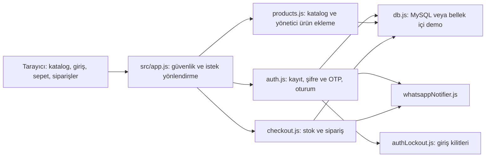

# SecureShop — kabul edilmiş uygulama planı

## 1. Durum ve yetki sınırı

- İnceleme tarihi: 21 Eylül 2026.
- Repo: `https://github.com/MrSqy/SecureShop.git`.
- İncelenen dal: `main`; commit: `6df3c58430b2c216e3ecf5fdf6b3c9fb83fa0e6e`.
- Başlangıç çalışma ağacında yalnızca izlenmeyen `AGENTS.md` vardı; korundu.
- Önceden `UYGULAMA_PLANI.md` bulunmuyordu. Bu dosya inceleme bulgularını ve ardından kabul edilen uygulama kapsamını birlikte tutar.
- Kullanıcının seçimi SecureShop'tur; PMS seçimi geri çekildi. `../PROJE_DURUMLARI.txt` içindeki SecureShop kaydı inceleme başlarken BAŞLANMAYAN'dan İŞLENEN'e taşındı.
- Kullanıcı, toplu değerlendirme ve başlangıç kapsamına 21 Eylül 2026'da **“Hepsini kabul ediyorum”** yanıtını verdi. **Bu yanıt kapsamı kabul etti; sonraki açık talimatla uygulama başlatıldı ve bölüm 8'deki sonuçlarla tamamlandı.** Kesin kapsam ve ayrı tutulan seçenekler bölüm 5'tedir.
- İnceleme ve karar kaydı aşamalarında ürün kodu, mevcut testler, bağımlılıklar, yapılandırma ve AWS betikleri değiştirilmedi. Commit/push/dağıtım yapılmadı. Bölüm 3'teki sonuçlar önceki incelemenin sonuçlarıdır; kapsam onayı sırasında yeniden test çalıştırılmış gibi yorumlanmaz.
- Kullanıcı 21 Eylül 2026'da **“Uygulamaya astra olarak geçebilirsin.”** diyerek uygulamayı bu görevde Astra ile başlattı. Önceki Sol uygulama iş paylaşımı bu görev için kullanıcının son talimatıyla değişti; yeni görev/model değiştirme işlemi yapılmaz.
- Aynı kabul edilmiş kapsam için yeniden öneri/onay turu açılmaz. Bu görevde Astra uygulaması bölüm 5'teki kapsamı ve bölüm 6'daki sırayı esas aldı. Yeni ürün tercihi veya kapsam genişlemesi ortaya çıkarsa ayrı olarak konuşulur.

## 2. İnceleme sırasındaki uygulama nasıl çalışıyordu?

SecureShop, Node.js üzerinde Express kullanan tek sunuculu bir güvenli e-ticaret demosudur. Node.js JavaScript'i sunucuda çalıştırır; Express gelen HTTP isteklerini ilgili fonksiyonlara yönlendirir. Ayrı bir React/Vue uygulaması veya derleme aşaması yoktur.

Tarayıcı `public/index.html` dosyasını yükler. Görünüm, stiller ve etkileşim kodu bu dosyada birlikte bulunur. İlk yüklemede CSRF anahtarı alınır, mevcut oturum kontrol edilir ve ürünler listelenir. CSRF anahtarı, başka bir sitenin kullanıcının adına işlem yaptırmasını önlemeye yardımcı olur; POST isteklerine eklenir.

Kayıt kullanıcı adı, telefon ve şifre alır. Şifre bcrypt ile tek yönlü özete çevrilir. Girişte önce şifre doğrulanır, ardından altı haneli OTP oluşturulur. OTP geçici sunucu belleğinde özetiyle tutulur. Doğrulanınca oturum kimliği yenilenir ve kullanıcı bilgisi oturuma yazılır. Tarayıcı `sid` çereziyle sonraki isteklerde tanınır. Şu an OTP'nin kendisi tarayıcı giriş denemesine bağlı değildir; bu bir bulgudur.

Sepet yalnızca sayfanın JavaScript belleğindedir; sayfa yenilenince kaybolur. Ürünler giriş yapmadan görülebilir; sepete eklemek için arayüz giriş ister. Sipariş sırasında tarayıcı ürün kimlikleri, adetler ve adres gönderir. Fiyatlar sunucudan alınır; aynı ürünün tekrarlanan satırları birleştirilir. Gerçek MySQL yolunda `FOR UPDATE` ile stok satırları kilitlenir, sipariş ve kalemleri yazılır, stok düşürülür, işlem onaylanır. Veritabanı işlemi/transaction, bu yazımların birlikte başarılı olması veya birlikte geri alınması içindir. Yerel sahte veritabanı şu an bu güvenceyi taklit etmiyor.

Sipariş ardından isteğe bağlı WhatsApp bildirimi, yapılandırmadaki sabit alıcıya gönderilir; otomatik olarak müşterinin telefonuna gitmez. Sipariş geçmişi ve detayında kullanıcı sahipliği kontrolü vardır. Ödeme alma, iade, kargo entegrasyonu, stok yönetim arayüzü, şifre kurtarma ve sipariş durum yönetim akışı yoktur. API'de yalnızca yönetici için ürün ekleme vardır, arayüzü yoktur.

### Dosya haritası

| Mevcut dosyalar | Rol ve ilişkisi |
| --- | --- |
| `src/app.js` | Express kurulumu, Helmet/CORS/CSRF/oturum, statik dosyalar, route bağlama, health, hata ve süreç olayları. |
| `src/config/session.js` | Auth ve app tarafından kullanılan `sid` çerez adı. |
| `src/routes/auth.js` | Kayıt, şifre girişi, OTP, çıkış, `/me`; DB, kilit servisi ve bildiriciyi kullanır. |
| `src/routes/products.js` | Liste/arama/sayfa, ürün detayı, yönetici ürün ekleme. |
| `src/routes/checkout.js` | Kimlik kontrolü, ürünleri birleştirme, stok/sipariş işlemi, geçmiş ve sahiplik kontrollü detay. |
| `src/models/db.js` | MySQL havuzu, üretim ayar kontrolleri ve SQL metinlerine göre davranan sahte DB; 17 örnek ürün. |
| `src/middleware/validation.js` | Kayıt/giriş/OTP/arama/adres/adet/kimlik doğrulaması ve hata yanıtı. |
| `src/middleware/rateLimiter.js` | IP başına giriş/kayıt/API istek sınırları; bellekte tutulur. |
| `src/middleware/errorHandler.js` | CSRF hatası, 404 ve genel hata yanıtları. |
| `src/services/authLockout.js` | Kullanıcı adına göre artan şifre/OTP kilitleri; bellekte tutulur. |
| `src/services/whatsappNotifier.js` | OTP ve sipariş mesajı, sahte gönderim veya Meta HTTP isteği. |
| `src/utils/logger.js` | Winston ile dosya/konsol kaydı; sınırlı hassas alan temizliği. |
| `public/index.html` | Bütün HTML/CSS/istemci JavaScript'i; güvenli DOM oluşturma, katalog, giriş, sepet, sipariş ekranları. |
| `tests/security.test.js` | Sahte DB/bildirici ile kayıt, OTP, kilit ve bazı CSRF kontrolleri. |
| `tests/checkout.test.js` | Sahte DB ile sipariş doğrulaması, stok, ürün birleştirme, sahiplik ve basit katalog kontrolleri. |
| `tests/whatsappNotifier.test.js` | Sahte `fetch`/logger ile mesaj sözleşmesi, hatalar ve yerel OTP görünürlüğü. |
| `aws/schema.sql` | Kullanıcı, kategori, ürün, sipariş/kalem ve kullanılmayan güvenlik audit tablosu; örnek katalog. |
| `aws/setup-aws.sh`, `aws/deploy-free-tier.sh`, `aws/userdata.sh` | Bulut kaynak ve makine hazırlama taslakları; mevcut uygulama için doğrulanmış dağıtım yolu değiller. |
| `aws_deployment_architecture.md` | Önerilen bulut topolojisi ve mevcut kaynakla uyuşmayan kurulum/başarı iddiaları. |
| `package.json`, `package-lock.json` | Komutlar ve kilitlenmiş bağımlılık ağacı. |
| `.github/workflows/security-ci.yml` | Node 20, `npm ci`, mevcut testler ve yüksek önem eşiğinde npm audit. |
| `.env.example`, `.gitignore` | Örnek ortam ayarları ve Git'ten dışlanan yerel çıktılar. |
| `README.md`, `docs/FINAL_LOCAL_VALIDATION.md`, `docs/GIT_TRANSFER_PREP.md`, `docs/PROJECT_TREE.md` | Kurulum, geçmiş doğrulama/devir notları ve dosya haritası. |
| `AGENTS.md`, `UYGULAMA_PLANI.md` | Birlikte çalışma kuralları ve bu inceleme/karar kaydı. |

`node_modules`, `logs` ve `coverage` üretilen/dış içeriktir. İnceleme için yalnızca `/tmp` kopyasında üretildi; ürün kaynaklarının parçası değildir.

## 3. Uygulama öncesi incelemede yapılan kontroller

Kaynakların Git'te izlenen sürümü `/tmp/secureshop-review-05uw43o1` içine kopyalandı. Node `v24.14.1`, npm `11.11.0` kullanıldı. Kurulum: `npm ci --ignore-scripts --no-audit --no-fund`, ayrı `/tmp` npm önbelleği. Kurulum betikleri çalıştırılmadı. İlk denemelerde sandbox DNS/soket engelleri görüldü; izinli tekrarlarla aşağıdaki kontroller tamamlandı. Bu ortam engelleri ürün hatası sayılmadı.

| Kontrol | İnceleme sonucu | Sınırı |
| --- | --- | --- |
| `npm test -- --runInBand --silent` | 3 test dosyası, 56 test geçti; 38,172 saniye. Statements %80,11; branches %61,24. | Gerçek MySQL/WhatsApp/AWS veya tüm tarayıcı davranışını kanıtlamaz. |
| JS sözdizimi | 15 kaynak/test JS dosyası + HTML içi script geçti. | Davranış doğruluğu kanıtı değildir. |
| `bash -n` | Üç AWS shell dosyası geçti. | Aşağıdaki komut bölünmesi hatalarını yakalamadı. |
| Güncel `npm audit --json` | 13 paket bulgusu: 4 yüksek, 6 orta, 3 düşük; 0 kritik. | Paket bildirimi sayısıdır; 13 ayrı uygulanabilir saldırı gösterimi değildir. |
| `npm audit --omit=dev --json` | Uygulama bağımlılıklarında 7 bulgu: 5 orta, 2 düşük; yüksek/kritik yok. | Dev bağımlılıklar dışlandı; kullanım yolunun sömürülebilirliği ayrıca değerlendirilir. |
| Üretim başlangıç korumaları | Eksik/kısa oturum sırrı, MemoryStore, DB mock, eksik DB ayarı ve localhost DB için 6 beklenen ret doğrulandı. | Üretimin başarılı çalıştırılması değildir; mevcut Jest dosyaları bu korumaları kapsamıyor. |
| Ek HTTP inceleme istekleri | Aşağıdaki ürün, OTP, uzun şifre, tekrar sipariş, adres ve 404 bulguları üretildi. | Geçici sahte DB ve sahte bildirici kullanıldı. |
| DB bağlantı hatası enjeksiyonu | Kimliği doğrulanmış checkout'ta `getConnection` reddi, yakalanmayan Promise ve süreç çıkışı `1`. | Gerçek DB kapatılmadı; yerel hata enjekte edildi. |
| Kontrollü OTP eşzamanlılığı | İki doğrulama bcrypt önünde buluşturuldu; gerçek bcrypt karşılaştırmaları sonrası iki istek de `200`, iki oturum da aktif. | Normal zamanlamalı ilk deneme `200/401` verdi. Yarış, kontrollü zamanlamayla doğrulandı; her istekte oluşur denmiyor. |
| AWS komut fragmanları | `aws` yalnızca argüman yazan shell fonksiyonuyla değiştirildi. İki RDS fragmanı da `127`, sonraki bayrak `command not found`. | Gerçek AWS CLI/ağ/kaynak işlemi yapılmadı. |
| Gerçek tarayıcı / masaüstü | Demo admin şifre + yerel OTP, sepete ekleme, sipariş, stok 50→49, sahip olunan sipariş detayı ve çıkış çalıştı. | Yerel sahte veri; gerçek ödeme/teslimat değildir. Mobil ve kapsamlı erişilebilirlik henüz doğrulanmadı. |
| Alternatif port | `127.0.0.1:3217` sayfası açıldı; kendi login POST'u CORS nedeniyle `500`. Varsayılan 3000 portunda akış çalıştı. | Üretim domaini ayrıca çalıştırılmadı. |

Geçici kanıt dosyaları: `/tmp/secureshop-baseline-tests.log`, `/tmp/secureshop-audit.json`, `/tmp/secureshop-audit-production.json`, `/tmp/secureshop-probes.json`, `/tmp/secureshop-race.json`, `/tmp/secureshop-db-failure.log`, `/tmp/secureshop-production-guards.json`. Geçici tekrar üretme betikleri kopyada `review-probes.cjs`, `review-race.cjs` adlarıyla bulunur. `/tmp` kalıcı arşiv değildir; temel kanıtlar aşağıya aktarılmıştır. Gerçek sır veya gerçek müşteri verisi kullanılmadı.

Teslim kontrolünde Git'te izlenen bütün dosyalar başlangıç kopyasıyla SHA-256 üzerinden karşılaştırıldı; fark bulunmadı. Commit değişmedi. İnceleme sunucuları ve geçici tarayıcı sekmesi kapatıldı. SecureShop durum dosyasında yalnız bir kez, İŞLENEN bölümünde bulunuyor.

## 4. Öncelikli bulgular ve çözüm yönleri

Kanıt türleri: **Çalıştırıldı** somut sonuç; **Kaynak** doğrudan kod/yapılandırma gözlemi; **Risk** etkisi ayrıca sınanması gereken çıkarım; **Ürün önerisi** mevcut kapsamı genişletecek tercih. Öncelik P1 ilk ele alınacak, P2 ardından, P3 ürün tercihidir. Aşağıdaki ilk değerlendirme ve çözüm açıklamaları korunmuştur; uygulanacak kabul edilmiş kapsam bölüm 5'te kesinleştirilmiştir. Koşula bağlı üretim seçenekleri ve ayrı sunulmuş ürün genişlemeleri bu kapsamla karıştırılmaz.

### A. Kimlik doğrulama — P1

**Kanıt:** `src/routes/auth.js:115` OTP'yi kullanıcı adıyla genel Map'e koyuyor; `:139–175` doğrulamasında şifre adımını geçen tarayıcı kontrol edilmiyor. Bir istemci şifre adımını tamamladıktan sonra başka bir istemci yalnızca kullanıcı adı + bilinen test OTP'siyle `200` alıp giriş yapabildi. Bu, rastgele OTP'nin bilindiği veya telefonun ele geçirildiği anlamına gelmez; şifre ve OTP adımlarının aynı giriş denemesine bağlanmadığını kanıtlar.

`auth.js:149–172` kayıt okuma ile tüketme arasındaki `await bcrypt.compare` atomik değildir. Kontrollü çakışmada aynı kod iki oturum açtı. `:29` kodu `Math.random` ile üretir; güvenlik amaçlı rastgele üretici kullanılmıyor. `validation.js:29–34` 128 karaktere izin verirken bcrypt ilk 72 baytı değerlendirir. 72 baytlık ortak başlangıçtan sonra farklı son eki olan iki şifre kayıt/giriş deneyinde eşdeğer kabul edildi; OTP yine gerekliydi.

**Öneri:** OTP'yi şifre doğrulaması sonrası oluşturulan, tarayıcı oturumuna bağlı rastgele bir challenge ile ilişkilendir; tüketmeyi tek işlem hâline getir. `crypto.randomInt` kullan. Yeni kod oluşturma/doğrulama için ayrı hesap/IP sınırları ve yeniden gönderme beklemesi ekle. Bcrypt korunacaksa UTF-8 bayt sınırını açıkça uygula; farklı hash algoritmasına geçişi ayrıca kararlaştır.

**Ek kaynak/risk:** `auth.js:125–127` üst üste giriş/gönderim sonuçları birbirinin OTP kaydını silebilir. `authLockout.js:19–53` başarısızlık kayıtlarını yaşlandırarak temizlemiyor; `pendingOtps` süresi geçen kaydı ancak tekrar sorulunca siliyor. `rateLimiter.js:30` başarılı şifre adımlarını sayaçtan çıkarıyor; dolayısıyla OTP gönderim bütçesi değildir. Kayıt/şifre/OTP kullanıcı adı biçimleri ve MySQL'in büyük-küçük harf duyarsız şeması tutarlı hâle getirilmeli. Hesap kapatılırsa aktif oturum/OTP yetkisinin nasıl kesileceği tanımlanmalı. Bunların tamamı canlı MySQL'de doğrulanmış hata değildir.

**Fayda/risk:** Gerçek iki aşamalı doğrulama ve tek kullanım güvencesi. Challenge değişimi istemci/API sözleşmesini etkiler; mevcut uzun şifre kullanıcıları için geçiş davranışı belirlenmelidir.

**Kabul:** Şifre adımı olmayan başka oturum kodu kullanamaz; aynı kodun eşzamanlı iki doğrulamasından en fazla biri başarılı; süresi geçen/yenilenen kod reddedilir; yeniden gönderim sınırı başarılı şifre isteklerinde de işler; 72 bayt sınırı çok baytlı Türkçe karakterlerle test edilir.

### B. Veritabanı ve sahte DB doğruluğu — P1

**Çalıştırıldı:** `GET /api/products/2` ve `/9999` ikisi de `id:1` döndürdü. `?page=2` 17 ürünün hepsini yeniden döndürdü; olmayan kategori de hepsini getirdi. Yönetici ürün POST'u `201` dedi ama kimlik üretmedi ve katalog 17 üründe kaldı. `beginTransaction → INSERT order → rollback` sonrası sipariş sayısı 2'den 3'e çıktı. Geçmiş kayıtları eski→yeni döndü ve MySQL SELECT'inin seçmediği alanları içerdi.

**Kaynak:** `src/models/db.js:127–155` SQL'in kimlik/sayfa/sıra ayrıntılarını uygulamıyor; bilinmeyen sorgu `:229` boş başarı sonucu alıyor; `:232–235` transaction fonksiyonları sadece log yazıyor. Ürün INSERT'i için mock uygulaması yok. `:251` development ortamında localhost'u `DB_MOCK=false` olsa da mock'a çeviriyor. Gerçek bağlantı başarısızlığı `:274–281` development'ta otomatik sahte veriye geçiyor.

**Öneri:** MySQL'i asıl veri deposu olarak koru. Yerel gerçek MySQL çalıştırma yolu ve ayrı test DB'si hazırla; gerçek SQL sözleşmesi/transaction testleri ekle. Mock seçimini açık bir ayara bağla; bağlantı hatasında sessiz veri deposu değiştirme. Mock tutulacaksa küçük bir veri erişim arayüzünün arkasında, desteklemediği işlemleri açık hatayla reddeden ve gerçek DB ile aynı sözleşmeyi sağlayan bir demo adaptörü olsun.

**Fayda/risk:** Demo ve gerçek ortamın farklı sonuç vermesi azalır; veri kalıcılığı açık olur. Yerel MySQL kurulum gerektirir. SQLite'a geçiş ayrı bir mimari değişikliktir ve bu planın varsayılan önerisi değildir.

**Kabul:** Ürün kimliği/404, arama/kategori/sayfa/sıra, kalıcı ürün ekleme, benzersiz kullanıcı ve transaction geri alma gerçek MySQL'de sınanır. İki alıcının son stok için eşzamanlı siparişi test edilir; mevcut mock testlerinin geçmesi bu kabulün yerine geçmez.

### C. Sipariş güvenilirliği — P1/P2

**Çalıştırıldı:** `src/routes/checkout.js:35` bağlantıyı `try` dışında bekliyor. Geçici `getConnection` hatası isteğin hata yanıtı yerine `app.js:213–215` üzerinden süreci kapattı. Aynı sipariş gövdesini iki kez göndermek iki ayrı `201` ve iki sipariş üretti.

**Kaynak/risk:** `checkout.js:87–118` transaction tamamlandıktan sonra bildirimi bekler ve bağlantıyı ancak sonrasında bırakır. `whatsappNotifier.js:112–120` açık bir uygulama zaman aşımı koymuyor; yavaş dış servis bağlantı havuzunu ve yanıtları bekletebilir. `rollback` hatası ilk hatayı maskeleyebilir. Para JS kayan noktalı sayısıyla hesaplanıyor (`:53–64`); mevcut deneyde hatalı tahsilat gösterilmedi, zaten ödeme entegrasyonu yok.

**Öneri:** Bağlantı alma/rollback/release yollarını güvenli `try/catch/finally` kapsamına al. Siparişi benzersiz istek anahtarıyla koru: aynı denemenin tekrarı yeni sipariş yaratmasın. Bu davranışa idempotency denir. İstemcide işlem sürerken düğmeyi kapat ama sunucu güvencesini de uygula. Bildirime süre sınırı koy, bağlantıyı önce bırak; güvenilir tekrar gönderim gerekirse siparişle birlikte bir bildirim işi kaydet. Parayı en küçük birimde tamsayı veya uygun decimal işlemleriyle hesapla.

**Fayda/risk:** DB/bildirim sorununda bütün servis durmaz, çift tıklama/yeniden deneme mükerrer sipariş oluşturmaz. Benzersiz anahtar ve bildirim işi tablo değişimi gerektirebilir. Bildirimin hatada yeniden denenip denenmeyeceği ürün kararıdır.

**Kabul:** Bağlantı ve rollback hatalarında süreç ayakta, bağlantılar serbest; aynı anahtar + aynı gövde tek sipariş, aynı anahtar + farklı gövde kontrollü hata; iptal edilen/ağda yarım kalan yanıt sonrası tekrar güvenli; stok eksiye düşmez; para sınırları ve çok kalemli toplamlar doğru; bildirim takılsa bile belirlenen sürede yanıt alınır.

### D. Ürün ve metin doğrulaması — P2

**Çalıştırıldı:** `27"` araması mevcut monitörü bulamadı; `O'Connor` adresi `O&#x27;Connor` olarak kaydedilip gerçek tarayıcıdaki sipariş detayında aynı bozuk biçimde gösterildi.

**Kaynak:** `validation.js:64–75,97–105` metni veritabanına/aramaya girmeden HTML biçimine çeviriyor. Arayüz zaten `textContent` kullandığından bu dönüşüm metni bozuyor. `products.js:107–128` yönetici yetkisini denetliyor fakat ad/fiyat/stok/kategori için şema doğrulaması yapmıyor. Bu son nokta anonim ürün ekleme açığı değildir; yönetici API'sinin veri bütünlüğü sorunudur.

**Öneri:** Girdinin türünü/uzunluğunu/aralığını doğrula; serbest metni özgün biçiminde sakla ve bağlama uygun güvenli çıkış üret. Parametreli SQL ve LIKE wildcard kaçışını koru. Ürün için pozitif fiyat, geçerli kategori, stok/ad sınırları ekle; DB kısıtlarını da eşleştir. Eski HTML entity içeren kayıtlar için kör toplu decode yapma; veri geçişi ayrıca kontrol edilmeli.

**Kabul:** Apostrof, tırnak, Türkçe karakter, `%`, `_`, ters eğik çizgi ve XSS benzeri metinler anlamını korur; kod çalıştırmaz. Geçersiz ürün girdileri hem uygulama hem veri katmanında reddedilir. Birleştirilen satırlarda toplam adet sınırının 99 mu stok kadar mı olduğu kararlaştırılır.

### E. Bağımlılıklar ve tarayıcı güvenlik ayarları — P1/P2

**Güncel tarama:** Toplam 13 bulgu. Yüksek olan dört paket: `brace-expansion`, `browserslist`, `form-data`, `js-yaml`; `--omit=dev` çıktısında yüksek bulgu yok. Çalışan uygulama ağacındaki 7 paket: `body-parser`, `cookie`, `csurf`, `express`, `mysql2`, `qs`, `uuid`. Bu, README'nin eski “yalnız 2 düşük + 1 orta” kaydıyla uyuşmuyor. CI'nin yüksek önem kapısı mevcut ağaçla başarı beklentisi sağlayamaz.

`csurf` bakımı bırakılmıştır. `uuid` ve doğrudan `validator` kullanımına src/public/tests içinde rastlanmadı; `validator`, express-validator üzerinden dolaylı olarak yine gereklidir. `.github/workflows/security-ci.yml` Node 20, AWS kurulumları Node 20, package engine ise >=18 diyor. Güncel resmi Node tablosunda 18 ve 20 EOL; 22/24 LTS.

`app.js:84` inline script'e izin veriyor. `public/index.html` JS/CSS'yi aynı dosyada taşıyor. Dış Google Fonts stylesheet'i ile `style-src` listesi ayrıca uyumlandırılmalı. `app.js:104–115` origin listesini sabitliyor; custom port tarayıcı deneyi `500` verdi; üretim listesi de `https://yourdomain.com` yer tutucusu.

**Öneri:** Node 24 LTS hattını ortaklaştır; kilitli bağımlılıkları uyumlu sürümlere güncelle, kullanılmayan doğrudan paketleri kaldırmayı doğrula, `csurf` yerine bakımı olan bir çözümü mevcut CSRF davranışını test ederek seç. Sadece audit temizlemek için `--force` veya eski csurf sürümüne düşürme yapma. JS/CSS'yi ayrı dosyalara taşı ve inline script iznini kaldır. Origin/proxy ayarlarını doğrulanmış ortam ayarına bağla; reddedilen origin için güvenli 4xx yanıtı ver.

**Fayda/risk:** Bakım yükü ve bilinen bağımlılık riskleri azalır; CSP daha faydalı olur. CSRF/cookie/proxy değişiklikleri giriş akışını bozabilir; aynı ve farklı origin, HTTPS ve çerez regresyonları zorunludur.

### F. Ekran akışları, kullanılabilirlik ve erişilebilirlik — P2/P3

**Gözlem/kaynak:** Masaüstünde temel alışveriş akışı çalıştı. Sepet bellekte; yenilemede kalıcı değil. `public/index.html:293–357` adet artırırken stok veya 99 sınırını kullanmıyor; sunucu sonradan reddediyor. `:279–284,528–531` HTTP hata yanıtlarını kontrol etmeden boş ürün/sipariş listesine çevirebiliyor. `:224–229` çıkış yanıtını kontrol etmiyor. Aynı sayfada Türkçe/İngilizce mesajlar, `pending` gibi teknik durumlar, açıklanmayan güvenlik terimleri var. Giriş alanları gerçek `<form>` değil; yalnız arama için Enter olayı var. Kapalı sepet sadece ekran dışına taşınıyor, erişilebilirlik ağacında alanları hâlâ görülüyor; odak yönetimi/ESC/duyuru alanları uygulanmamış.

**Öneri:** Tek bir istek/hata yönetimi, alan bazlı Türkçe mesajlar, işlem sürerken düğme durumu, oturum süresi dolduğunda açık yeniden giriş, OTP geri dön/yeniden gönder/süre bilgisi, stokla uyumlu adetler ve sipariş başarı özeti. Sepette kullanıcıya bağlı kalıcılık tercih edilecekse çıkış/hesap değişiminde veri karışmasını önle. Form semantiği, klavye kullanımı, odak yönetimi, ekran okuyucu adları ve mobil görünüm testleri ekle. Katalog kategori/sayfa kontrolü ve ürün açıklaması gösterimi mevcut API'yle uyumlu tamamlanabilir. Teknik öğretimi ürün ekranından proje rehberine taşı.

**Fayda/risk:** Kullanıcı hatayı anlayabilir ve işlemi yanlışlıkla tekrarlamaz. Sepeti saklamak davranış/veri tercihi; misafir sepeti yeni ürün kuralı; kapsamlı görsel yeniden tasarım bu düzeltmelerden ayrı karardır.

**Kabul:** Klavyeyle uçtan uca akış; kapalı sepet odak alamaz; 401/403/429/500 boş sonuç gibi sunulmaz; stok üstü adet arayüzde engellenir; yenileme/çıkış/hesap değişimi kararlaştırılan sepet davranışına uyar; masaüstü ve mobil gerçek tarayıcı kontrolleri yapılır.

### G. Üretim çalışma modeli, kayıtlar ve bakım — P2, hedefe bağlı

**Kaynak:** Oturum, OTP, kilit ve rate-limit durumları süreç belleğinde. `app.js:60–69` kalıcı oturum deposu seçeneği sunmadan üretimi reddediyor; geçici MemoryStore istisnası çok sunuculu çözüm değildir. `/health` yalnız sürecin yanıt verdiğini söylüyor, DB hazır olmasını ölçmüyor. `app.js:185` bilinmeyen API GET'ini HTML `200` yapıyor; `/api/does-not-exist` ile doğrulandı. Kontrollü shutdown/havuz kapatma yolu yok. `db.js:89` demo SQL parametrelerini logluyor; test kayıtlarında telefon, şifre özeti ve adres görüldü. `logger.js:49–52` sadece bazı üst düzey alanları siliyor; OTP development'ta dosyaya da yazılıyor.

**Öneri:** Yerel demo ile gerçek servis modunu açık tanımla. Gerçek servis hedefinde paylaşılan oturum/OTP/kilit deposu, TTL temizliği, yapılandırma doğrulaması, liveness/readiness ayrımı, istek kimliği, sınırlı ve maskelenmiş loglar, kontrollü kapanış ekle. Tek sunucu/MySQL için DB destekli durum deposu, çok sunucu hedefinde Redis alternatifi değerlendirilebilir; Redis otomatik kabul edilmiş değildir. Bilinmeyen `/api` için JSON 404 sağla.

**Fayda/risk:** Yeniden başlatma ve çok sunucu davranışı öngörülebilir olur; loglarda gereksiz özel veri azalır. Yeni servis işletme/yedekleme yükü getirir. Hesap kurtarma, telefon doğrulamalı kayıt, gerçek yönetici arayüzü, sipariş iptal/iade ve ödeme ayrı ürün genişlemeleridir.

### H. AWS dosyaları — P1 belge doğruluğu, dağıtım ayrı kapsam

**Çalıştırılmış yerel kanıt:** `aws/deploy-free-tier.sh:126–127`, `aws/setup-aws.sh:194–200` devam karakterinden sonra boşluk/yorum koyuyor. Shell komutu orada biter; izleyen `--allocated-storage` veya `--storage-encrypted` ayrı komut sanılır. `bash -n` geçmesine rağmen yalnız argüman yazan AWS taklidiyle iki fragman da `127` verdi.

**Kaynak:** Free-tier betiğinde kod klonlama ve servisi başlatma yorum satırı, DB_HOST localhost, uygulamanın üretim guardlarıyla uyumsuz ayarlar ve yalnız HTTP var (`:159–197`); buna rağmen yayında/0 dolar mesajı veriyor. `userdata.sh:18` klonlama yorumda; üretim oturum deposu yok. `ProtectSystem=strict` ile uygulamanın dosya log yazımı da uyumlandırılmalı. `setup-aws.sh` uygulama ASG'sini yalnız bir AZ subnet'ine bağlıyor (`:268`), HTTPS listener'ı/sertifikayı ve WAF'ı sonraya bırakıyor; launch template için IAM instance profile ve private subnet dış erişim yolu tanımlanmamış. SSM parametrelerinin hazırlanması, uygulama kodu, gerçek session deposu ve DB TLS güven zinciri uçtan uca doğrulanmış değil. Linux `base64` satır sarması inline JSON UserData'sında ayrıca risk oluşturur. Bunlar gerçek bulut denemesi sonuçları değildir.

**Öneri:** Önce belgeleri gerçek durumla eşleştir, çalışmayan taslakları otomatik deploy diye sunma ve mutlak ücretsiz/güvenli/tam puan iddialarını kaldır. Canlı AWS istenirse tek bir hedef mimari, hesap/bölge/bütçe, HTTPS, secret yönetimi, test ve söküm planıyla ayrı iş paketi oluştur. Mevcut betikleri inceleme aşamasında çalıştırma.

**Fayda/risk:** Yarım kuruluma veya yanlış maliyet beklentisine güvenilmez. AWS onarımı uygulama hatalarından büyük ve maliyet doğurabilecek bir kapsamdır. Güncel ücretsiz katman hesap tarihine/plana/kredilere bağlı; koşulsuz sıfır fatura sözü geçerli bir dağıtım garantisi değildir.

### I. Testler ve öğretici dokümantasyon — P1/P2, diğer paketlerle birlikte

**Kanıt:** 56 test geçiyor, fakat ürün detay/ekleme, gerçek DB, rollback, OTP oturum bağlantısı/eşzamanlılığı, DB bağlantı reddi ve production guardları mevcut testlerde kapsam dışı. Branch kapsamı %61,24; %80 statement oranı güvenlik garantisi değildir. README'nin test sayısı doğrulandı; bağımlılık sayısı güncel değil. README ağaçta `docs/LOCAL_DEPENDENCY_AUDIT.md` ve `docs/LOCAL_TESTING_CHECKLIST.md` diyor, bu dosyalar yok. Kapsamlı `PROJE_REHBERI.md` bulunmuyor. `docs/FINAL_LOCAL_VALIDATION.md` manuel tarayıcı listesini tamamlanmış gibi yorumlamamak gerekir.

**Öneri:** Her kabul edilmiş düzeltmenin davranış testini onunla birlikte ekle. Gerçek MySQL entegrasyonu ve gerçek tarayıcı senaryolarını unit/mock testlerinden ayır. CI'de bunları uygun işlere böl, üretim başlangıç olumsuz/olumlu senaryolarını ve bağımlılık denetimini tut. Eski raporları tarihli kayıt olarak etiketle; README güncel ve tekrar üretilebilir olsun. İş sonunda son kaynakla eşleşen Türkçe `PROJE_REHBERI.md` oluştur ve README'den bağla.

Rehber kabulü: her proje dosya/klasörünün amacı ve ilişkisi; bütün fonksiyon/sınıf/dosya düzeyi blokların girdisi, çıktısı, durum değişimi, hata yolu ve algoritması; kavramlar ilk kullanıldığında örnekle açıklama; kayıt→OTP→sepet→sipariş uçtan uca izleme; kurulum, test, hata ayıklama ve güvenli geliştirme. Kaynak alıntıları, komutlar ve bağlantılar teslimden önce son kodla karşılaştırılır. Bu inceleme planı o kapsamlı son rehberin yerine geçmez.

## 5. Kabul edilmiş kapsam — 21 Eylül 2026

Karar kaydı: kullanıcı bütün başlangıç önerilerini kabul etti. Bu kabul, toplu değerlendirmenin sonunda önerilen demo hedefini ve aşağıdaki düzeltme paketlerini kapsar. Aynı değerlendirmede ayrı seçim olarak sunulan ek özellikler ve canlı hizmetler sonraki kapsam kararları olarak kalır.

| Başlık | Kabul edilen karar |
| --- | --- |
| Ürün hedefi | Güvenilir, öğretici, yerel çalıştırılabilir güvenlik/e-ticaret demosu. |
| A — Kimlik doğrulama | Şifre + OTP korunur. Oturuma bağlı giriş denemesi, atomik kod tüketimi, güvenli rastgele üretim, kod süresi/yenileme/sınırları ve bcrypt UTF-8 bayt sınırı düzeltilir. Yerel doğrulamalar sahte bildiriciyle yapılır. |
| B — Veri katmanı | MySQL korunur; yerel gerçek DB kurulumu ve izole entegrasyon test yolu eklenir. Mock açıkça seçilir; yanlış ürün/arama/kategori/sayfa/sıra, sahte ekleme başarısı ve transaction tutarsızlıkları giderilir. Sessizce mock'a geçiş kaldırılır. |
| C — Sipariş | Bağlantı alma, hata, rollback ve release yolları düzeltilir. Tek sipariş denemesinin tekrarı mükerrer kayıt üretmez; arayüzde işlem durumu gösterilir. Bildirime süre sınırı, erken bağlantı bırakma ve doğru para hesabı eklenir. |
| D — Girdi/veri doğruluğu | Özgün metin korunur; güvenli DOM/SQL yöntemleri sürdürülür. Ürün adı, fiyatı, stoku ve kategorisi doğrulanır. Arama ve adres bozulmaları düzeltilir. |
| E — Bağımlılık/tarayıcı güvenliği | Desteklenen Node 24 LTS hattı ortaklaştırılır, bağımlılıklar kontrollü güncellenir, kullanılmayan doğrudan paketler doğrulanarak kaldırılır. CSRF çözümü regresyonlarla değiştirilir; JS/CSS ayrımı, CSP ve yapılandırılabilir origin/proxy ayarları tamamlanır. |
| F — Temel kullanıcı akışları | Türkçe ve alan bazlı hata mesajları, yükleme/işlem durumları, oturum süresi sonu, OTP geri dön/yeniden gönder/süre bilgisi, stokla uyumlu adetler ve sipariş başarı özeti iyileştirilir. Form/klavye/odak/ekran okuyucu davranışları ve mobil kontroller tamamlanır. |
| G — Yerel çalışma ve bakım | Demo/gerçek servis ayarları açıklaştırılır; API hata/JSON 404, health/readiness, yapılandırma doğrulaması, hassas logları azaltma, geçici kayıt temizliği ve kontrollü kapanış ele alınır. Demo hedefi için yeni Redis veya çok sunuculu üretim altyapısı eklenmez. |
| H — AWS kapsamının doğruluğu | Belge ve taslaklar gerçek durumla eşleştirilir; çalışmayan/eksik adımlar ve maliyet sınırları açık yazılır. Gösterilmiş shell komut bölünmeleri yerel taklit/statik kontrollerle ele alınır. Bu paket gerçek AWS kaynağı oluşturmayı veya uçtan uca bulut dağıtımını içermez. |
| I — Testler ve rehber | Her düzeltme ilgili davranış testiyle gelir. Gerçek MySQL ve tarayıcı kontrolleri mock testlerinden ayrılır; CI ve güncel raporlar buna göre düzenlenir. Son kaynakla eşleşen kapsamlı Türkçe `PROJE_REHBERI.md` hazırlanıp README'den erişilir. |

### Ayrı seçim olarak sunulmuş, bu başlangıç paketine dahil olmayan işler

- Gerçek ödeme, canlı AWS dağıtımı ve gerçek WhatsApp hesabı/şablonlarıyla mesaj gönderme.
- Yeni admin paneli, hesap kurtarma, telefon doğrulamalı kayıt, sipariş iptal/iade ve kargo özellikleri.
- Misafir sepeti, sepetin kalıcı saklanması, yeni kategori/ürün detay ekranları ve kapsamlı görsel yeniden tasarım.
- Redis/çok sunuculu çalışma veya yeni bir hash algoritmasına geçiş.
- Gerçek mevcut kullanıcı/adres verisinin toplu göçü ve kalıcı bildirim kuyruğu/otomatik tekrar gönderme ürünü.

Bu seçeneklerin ayrı kalması kabul edilmiş düzeltmeleri yeniden onaya açmaz. Uygulamada mevcut iş kuralını değiştirmek gerektiği kanıtlanırsa yalnız yeni karar konuşulur; örneğin birleştirilmiş ürün adedinin 99 ile mi stokla mı sınırlanacağı mevcut API davranışıyla birlikte netleştirilir. Ortam engelleri başarı gibi sunulmaz ve kabul edilmiş işler sessizce kapsamdan çıkarılmaz.

### Uygulama aşamasına geçiş

- Durum: **kabul edilmiş kapsam Astra ile uygulandı**. Güncel doğrulamalar bölüm 8 ve `docs/DOGRULAMA.md` içindedir.
- Uygulama aşamasında repo, dal/commit, yerel `AGENTS.md` ve bu plan tekrar doğrulanır; aynı kapsam için yeniden genel onay istenmez.
- Yeni görev/model ayarı değiştirme işlemi bu onaydan çıkarılmaz. Mevcut kullanıcı iş paylaşımı izlenir.
- Bu ilk kapsam onayı commit/push veya canlı dağıtımı içermiyordu. Daha sonraki commit/push talimatı bölüm9'da kayıtlıdır; canlı dağıtım kapsam dışında kalır.

## 6. Kabul edilen kapsamın uygulama sırası ve önerilen commit ayrımı

Aşağıdaki sıra uygulama için esas alınır; teknik bağımlılıklar gerektirdiğinde kapsamı değiştirmeyen sıralama düzenlenebilir. Commit oluşturma ayrıca kullanıcının talimatı kapsamında olmalıdır.

| Aşama | Önerilen anlamlı değişiklik grubu | Etkilenecek mevcut alanlar | Kabul kapısı |
| --- | --- | --- | --- |
| 1 | Ortam/bağımlılık ve test temeli | `package*.json`, CI, `.env.example`, test altyapısı | Kilitli temiz kurulum, mevcut testlerin korunması, audit sonuçlarının açıklanması. |
| 2 | Veri erişimi ve MySQL/mock sözleşmesi | `src/models/db.js`, `aws/schema.sql`, ilgili route/testler | Gerçek DB CRUD, kısıtlar, rollback ve stok yarışı. |
| 3 | Giriş güvenliği | auth, authLockout, validation, notifier, session, istemci auth bölümü | Oturuma bağlı ve atomik OTP, doğru limit/sona erme, şifre sınırı. |
| 4 | Sipariş dayanıklılığı ve alan doğrulama | checkout, products, validation, DB/şema, notifier | Bağlantı hatası, tek sipariş/tekrar deneme, para/stok, bildirim timeout. |
| 5 | Tarayıcı güvenliği ve kullanıcı akışları | app, errorHandler, `public/index.html` ve kararlaştırılırsa yeni JS/CSS modülleri | CSP/CSRF/CORS, güvenli metin, masaüstü/mobil/klavye uçtan uca. |
| 6 | Çalışma modeli ve kayıtlar | app, session, logger, DB ve seçilirse durum deposu | Doğru health/404, maskeli log, kapanış; seçilen dağıtım modeli. |
| 7 | Belgeler ve AWS kapsamının doğruluğu | README, docs, AWS taslakları/mimari notu, yeni `PROJE_REHBERI.md` | Son kaynakla dosya/fonksiyon kapsamı, komut/bağlantı QA; doğrulanmamış ortamların açık işaretlenmesi. |

Yeni kaynak dosyalarının adları burada mevcut dosya gibi sunulmamıştır. Kabul edilmiş davranışları sağlayan dosya ayrımı uygulama sırasında netleşir; yeni ürün veya altyapı tercihleri kendiliğinden eklenmez. Rehber her aşamada güncellenir; en sonda kaynakla bütünlük kontrolü yapılır.

## 7. Dış kaynak doğrulamaları

21 Eylül 2026'da kontrol edildi. Paket sürümü ve servis politikaları zamanla değişir; uygulama sırasında yeniden doğrulanmalı.

- [csurf resmi deposu](https://github.com/expressjs/csurf): arşivlenmiş, aktif bakım yok.
- [bcrypt.js resmi güvenlik açıklaması](https://github.com/dcodeIO/bcrypt.js#security-considerations): 72 bayt sınırı. Yeni sürüm API'leri eski 2.4.3'te varmış gibi varsayılmamalı.
- [Node sürüm yaşam döngüsü](https://nodejs.org/en/about/previous-releases): 18/20 EOL, 22/24 LTS.
- [Node crypto.randomInt](https://nodejs.org/api/crypto.html#cryptorandomintmin-max-callback): güvenlik kodu üretimi için önerilen yerleşik API.
- [Express hata yönetimi](https://expressjs.com/en/guide/error-handling/): asenkron hataları ilgili Express sürümüne uygun hata akışına taşıma.
- [AWS Free Tier güncellemesi](https://aws.amazon.com/blogs/aws/aws-free-tier-update-new-customers-can-get-started-and-explore-aws-with-up-to-200-in-credits/): hesap tarihine göre değişen ücretsiz kullanım planları; koşulsuz sıfır maliyet garantisi yok.

İnceleme aşamasında gerçek MySQL, gerçek WhatsApp teslimatı, GitHub Actions üzerinde CI, bulut dağıtımı ve mobil görünüm doğrulanmamıştı. Uygulama sonrası MySQL/mobil sonuçları bölüm 8'dedir; kapsam dışı canlı sistemlerin sınırı korunmuştur.

## 8. Astra uygulaması ve teslim — 21 Eylül 2026

Kullanıcının “Uygulamaya astra olarak geçebilirsin.” talimatıyla bu görevde uygulandı. Commit, push, canlı AWS veya gerçek mesaj gönderimi yapılmadı. Başlangıçtaki AGENTS.md korundu; yeni görev/model değişikliği yapılmadı.

| Kabul paketi | Son davranış ve kanıt |
| --- | --- |
| A | OTP sessionID'ye bağlı, HMAC ile tutuluyor, senkron tüketiliyor; cooldown ve hesap bazlı gönderim bütçesi var. Başka oturum/eşzamanlılık/eski teslimat/UTF-8 şifre sınırı testleri geçti. |
| B | Tipli mock/MySQL adapter'ları, ortak seed ve sözleşme; açık DB_MOCK. Gerçek MySQL8.4 ve Compose/db:init kurulum yolu test edildi. Rollback/kısıtlar/sıralama/literal arama doğrulandı. |
| C | Bağlantı alma try içinde; rollback/release korunuyor, rollback arızasında bozuk SQL bağlantısı atılıyor. UUID işlem anahtarı + normalize gövde özeti, tam sayı kuruş, bildirimden önce release ve bildirim timeout var. Gerçek MySQL stok yarışı ve tarayıcıdan kaybolan yanıt/aynı sipariş tekrarı geçti. |
| D | Özgün adres ve arama metni korunuyor; ürün şeması route/model/DB kısıtlarıyla denetleniyor. Ham satır1–99, birleşmiş satır stok sınırı biçimindeki mevcut API kuralı korundu; yeni ürün tercihi eklenmedi. |
| E | Node24, güncel kilit dosyası, csrf-sync; kullanılmayan doğrudan paketler kaldırıldı. Harici JS/CSS, inline izinsiz CSP, exact origin/proxy guard'ları var. Temiz npm ci ve audit0; cookie/CSRF/CORS regresyonları geçti. |
| F | Türkçe alan/hata/süre mesajları, işlem kilidi, readonly belirsiz sipariş, stokla sınırlı adet, form/Enter, dialog/Escape/odak. Masaüstü ve390/320px mobil akışlar gerçek tarayıcıda doğrulandı. Sepet sayfa belleğinde kaldı; yenileme/çıkış/hesap değişimi doğrulandı. |
| G | JSON404, health/ready, güvenli log/gerçek dosya transport kontrolü, süreli kayıt temizliği ve SIGTERM kapanışı eklendi. Tek süreç/bellek deposu sınırı açık kaldı; Redis eklenmedi. |
| H | Üç AWS script'i eksik taslak olarak erken exit1 ile duruyor. Shell devamları ve base64 satır sarması düzeltildi; maliyet/yayında garantileri kaldırıldı. Yerel stub/statik kontrol yapıldı; bulutta çalışma iddia edilmedi. |
| I | 92 birim/HTTP/işletim regresyonu + ayrı gerçek MySQL yolunda11 test geçti. CI Node24 ve ayrı MySQL işiyle güncellendi. README'den erişilen PROJE_REHBERI.md bütün59 proje dosyası ve adlandırılmış kaynak işlevleriyle karşılaştırıldı. Eski raporlar tarihsel etiketlendi. |

Son ayrıntılı sonuçlar ve sınırlar: [doğrulama kaydı](docs/DOGRULAMA.md). Kurulum, kaynak işlevleri, veri/olay/hata akışları: [proje rehberi](PROJE_REHBERI.md).

İlk teslimde açık veya kapsam dışı noktalar: gerçek ödeme/WhatsApp/AWS, GitHub üzerinde CI yürütmesi, paylaşılan üretim durum deposu, gerçek eski DB göçü ve tam ekran okuyucu sertifikasyonu. Yerel MySQL kurucusu dolu DB'yi değiştirmeyi reddeder; eski veriyi taşımış gibi sunulmaz. Jest29 alt ağacındaki inflight/glob için npm deprecation uyarıları sürer; son audit bunları açık güvenlik bulgusu olarak raporlamadı.

Tamamlama kaydı: `../PROJE_DURUMLARI.txt` içindeki yalnız SecureShop kaydı İŞLENEN bölümünden TAMAMLANAN bölümüne taşındı. Diğer projelerin durumları korundu.

## 9. Commit düzenleme ve push kapsamı — 21 Eylül 2026

Kullanıcının “Yerel commitleri düzenle, başka geliştirmeler varsa uygula, sonra pushla.” talimatı commit ve uzak depoya gönderme yetkisini ekledi. Başlangıçta HEAD ve origin/main aynı6df3c58 commit'indeydi; düzenlenecek önceki yerel commit yoktu, kabul edilmiş uygulama dosyaları henüz commitlenmemişti. Uzak geçmiş yeniden yazılmadan normal commit ve fast-forward push yolu seçildi.

Anlamlı ayrım: AWS taslaklarının dürüstleştirilmesi ve erken ret koruması; birbirine bağlı uygulama/API/şema/arayüz ve rehber paketi; son incelemede bulunan sipariş tekrar düzeltmesi ve regresyonu. Paket, CSRF ve API değişimleri eski arayüzle uyumlu olmadığı için çekirdek uygulama aynı commit'te tutuldu.

Ek bulgu: kaybolan sipariş yanıtından sonra429 veya403 gelmesi istemcide pendingOrder'ı siliyordu. Sonraki deneme yeni UUID ile ikinci sipariş oluşturabilirdi. Reddedilen bir tekrar, önceki isteğin kaydedilmediğini kanıtlamaz. Artık yalnız tanınan400 alan/stok/ürün/tutar retleri düzenlemeyi açar; diğer belirsiz retlerde aynı anahtar ve gövde korunur. CSRF hata metni bekleyen işlemi sayfa yenilemeyle kaybetmeye yönlendirmez.

Gerçek tarayıcı kaynağıyla yeni8 regresyonun6'sı eski kodda başarısızdı; düzeltmeyle8'i de geçti. Testlerin küçük DOM/fetch taklitleri kullandığı, gerçek tarayıcı ve SQL kanıtlarının ayrı olduğu rehberde açıklandı. Son sonuçlar docs/DOGRULAMA.md dosyasındadır.

İlk üç commit normal push ile origin/main'e gönderildi.65a910a için gerçek GitHub Actions unit/mysql işleri geçti. Ardından CI'nın Node20 action motoru uyarısını gidermek için resmi Node24 tabanlı checkout v7.0.1/setup-node v7.0.0 sürümleri ayrı bakım commit'ine alındı. Yeni ürün kapsamı eklenmedi; son workflow sonucu ayrıca doğrulanır.

## 10. MIT lisansı — 21 Eylül 2026

Kullanıcı önce taslağı inceledi, ardından “Uygundur. Bunu oluşturup pushlayabiliriz.” diyerek uygulama ve push için onay verdi. Başlangıç dalı main, commit 3140fae; çalışma ağacı temizdi.

Kabul edilen metin InvestSim reposundaki standart MIT metninin aynısıdır. Telif sahibi ve yıl: `Copyright (c) 2026 Baran Demir B.`. Kök LICENSE dosyası, README lisans bölümü, package.json lisans alanı ve npm ile eşleştirilen package-lock.json kök proje kaydı bu kapsamın parçalarıdır. Rehber ve dosya envanteri de yeni dosyayı kapsar. Üçüncü taraf bağımlılıklar kendi lisanslarına tabidir.

Bu çalışma tek bir lisans commiti olarak gönderilir. Kabul kontrolleri: lisans metninin onaylanan örnekle birebir eşleşmesi, iki paket kaydında MIT bulunması, bağımlılık kayıtlarının korunması, yerel bağlantı/rehber envanteri ve git diff --check. Uygulama davranışı değişmediğinden yeni davranış testi eklenmez; push ile mevcut CI işleri çalışır.
